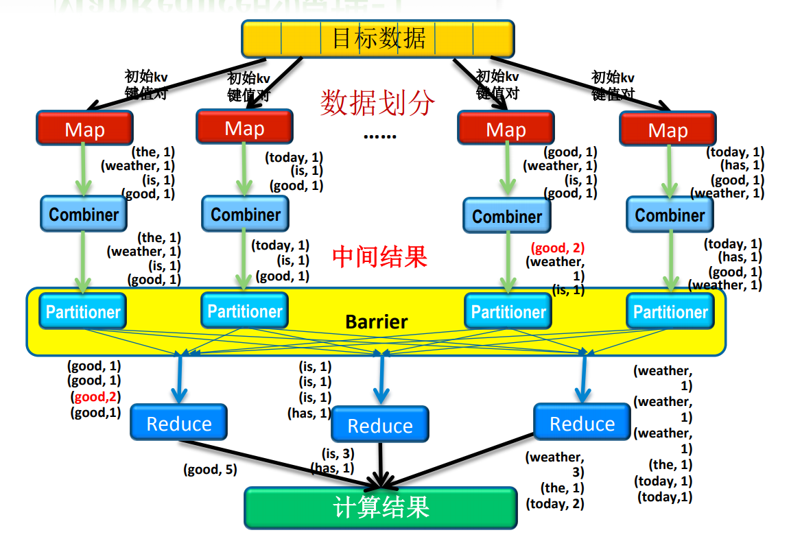

# MapReduce的概念、原理和应用

## 概念
+ Map Step
  + Master node takes the input, partitions it up into smaller sub-problems, and distributes it into worker nodes. A worker may do this again in turn, and thus resulting in a multi-level tree structure. The worker processes the smaller problems, and passes the answer back to the master node.
+ Reduce Step
  + The master node takes the answers of all the sub-problems and combines them in some way to get the final output.

## 整体流程

+ Map和Reduce为需要用户完成的部分

+ **Step1**：MapReduce库会首先将输入分割成16 MB到64 MB大小的块，然后会在节点簇上启动程序的多个副本
+ **Step2**：在启动的程序副本中，有一个是master，其他均为被分配了工作负载的workers。工作负载分为两种---Map和Reduce
+ **Step3**：被分配到Map工作负载的worker从相应的input split中读取内容，处理得到key-value键值对并存储在buffer当中
+ **Step4**：存储在buffer中的key-value键值对将通过“local write”的形式写入local disk，并由partitioning function分割成R个区域。这些buffered key-value pairs在local disk上的位置将被传递给master节点，由master节点将key-value pair的位置发送给reduce节点
+ **Step5**：reduce worker接收到master发送的数据地址后，使用“remote read”方式读取出key-value pair数据并对相同的key进行group处理
+ **Step6**：根据用户定义的reduce function，对key-value pair进行处理，得到输出

## MapReduce的函数定义
+ Distributed Grep
  + **Map**: A line if it matches a supplied pattern
  + **Reduce**: An identity function that just copies the supplied intermediate data to the output
+ Count of URL Access
  + **Map**: Process logs of web page requests and output <URL, 1>
  + **Reduce**: Add together all values for the same URL and emits <URL, total> pair
+ Reverse Web-Link Graph
  + **Map**: Output <target, source> pairs for each link to a target URL found in a page named source
  + **Reduce**: Concate the list of all source URLs associated with a given target URL and emits the pair <target, list(sources)>