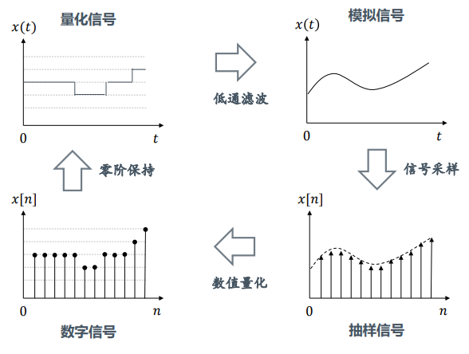
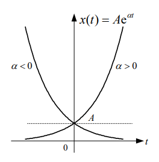
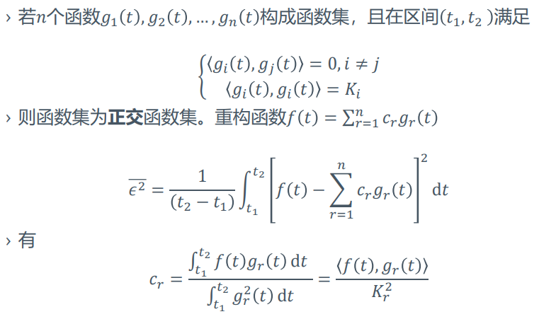

# 信号基础
---
## 信号的分类
+ **连续信号、模拟信号、离散信号、数字信号**
  + 连续信号：观测过程连续，并允许时间定义域上有有限个间断点
  + 模拟信号：观测过程连续，并且在任意时刻的取值也是连续的连续信号
  + 离散信号：信号仅在规定的离散时刻有定义
  + 数字信号：取值为离散的离散信号  
  
+ **确定信号和随机信号**
  + 确定信号：能够以确定的时间函数表示的信号
  + 随机信号：信号的在任意时刻的取值都具有不确定性，只能知道它的统计特性
+ **周期信号**
  + 连续周期信号：$\forall t\in \mathbb{R} $，$\exists T>0,s.t.x(x+t)=x(t)$
  + 离散周期信号：$\forall n\in \mathbb{N} $，存在正整数$N$，使得$x[n+N]=x[n]$
  + 上述满足条件的最小的$T/N$称为信号的基波周期
  + **离散信号可视作连续（包络线）信号和周期脉冲的乘积**
  + **对于两个周期信号$x(t)$，$y(t)$，设它们的周期分别为$T1, T2$，若其周期之比$T1/T2$为有理数，则其和信号$x(t)+y(t)$仍然是周期信号，其周期为$T1,T2$的最小公倍数。**
  + e.g.:连续正弦信号一定是周期信号，但是正弦序列不一定是周期序列。（从离散序列可被视作连续信号与周期脉冲的乘积的观点导出）
+ **能量信号和功率信号**  
  
  + 能量信号：$0<W<\infty, P=0$
  + 功率信号：$W\to\infty, 0<P<\infty$
  + 一个信号可能既不是能量信号也不是功率信号，但不能二者兼是。

---
## 典型信号

### 基本连续信号
+ **直流信号**
  $$x(t)=A, -\infty<t<+\infty$$
+ **正弦信号**
  $$x(t) = A\sin(\omega_0 t+\phi)$$
  + $A$为振幅，$\omega_0$为角频率，$\phi$为初始相位
  + 周期为$T=\frac{2\pi}{\omega_0}$

+ **实指数信号**
  $$x(t) = Ae^{\alpha t}$$
  + $A$和$\alpha$都是实数，取值不同时信号特征不同

+ **虚指数信号**
  $$x(t)  =Ae^{\alpha t}$$
  + $\alpha$为纯虚数，例如$x(t)=e^{j\omega t}$
  + 周期性，$T_0=\frac{2\pi}{|\omega_0|}$
  + 与正弦信号的关联$e^{j\omega_0 t}=\cos \omega_0t+j\sin \omega_0 t$
  + 可看作在实轴上的正弦信号和虚轴上的周期信号的叠加

> 例：画出以下信号的模
> $$x(t)=e^{j2t}+e^{j3t}$$
> 解：$x(t)=e^{j2.5t}(e^{j0.5t}+e^{j-0.5t})=2e^{j2.5t}\cos 0.5t$
>    故$|x(t)|=2|\cos 0.5t|$

+ **复指数信号**
  $$x(t)=Ae^{st}$$
  + $A$为复数，使用极坐标表示：$A=|A|e^{j\theta}$
  + $s$为复数，使用笛卡尔坐标表示：$s=r+j\omega_0$
  + 得到
  $$x(t)=Ae^{st}=|A|e^{j\theta}e^{r+j\omega_0t}=|A|e^{rt}e^{j(\omega_0 t+\theta)}$$
  + 可被看作是具有指数衰减振幅的正弦信号，即**阻尼正弦振荡**

  

+ **抽样信号**
  $$Sa(t)=\frac{\sin t}t$$
  + 主要性质
    + $Sa(0)=\lim\frac{\sin t}t=1$
    + $Sa(k\pi)=0$
    + $\int_{-\infty}^{+\infty}Sa(t)dt=\pi$  
    
  + 另外一种抽样信号：$\text{sinc}(t)=\frac{\sin(\pi t)}{\pi t}$

### 基本离散序列
+ **实指数序列**
  $$x[n]=Ar^n$$
  + 若令$r=e^\beta$，则
  $$x[n]=Ae^{\beta n}$$
+ **虚指数序列**
  $$x[n]=e^{j\omega_0 n}$$
+ **复指数序列**
  $$\begin{aligned}
  x[n]&=Az^n\\
  &=Ae^{j\theta}(|z|e^{j\omega_0})^n\\
  &=A|z|^n\cos(\omega_0 n+\theta)+jA|z|^n\sin(\omega_0 n+\theta)
  \end{aligned}$$  
  
+ **离散时间单位脉冲**
  $$\delta[n] = \left\{
    \begin{aligned}
    &1, n=0\\
    &0, n\not = 0 \\
    \end{aligned}
    \right .$$
  + 使用离散时间单位脉冲可以表示任意离散序列
+ **离散时间单位阶跃**
  $$u[n] = \left\{
    \begin{aligned}
    &1, n\geq0\\
    &0, n<0 \\
    \end{aligned}
    \right .$$
  + 与单位脉冲的关系
  $$\delta[n]=u[n]-u[n-1]$$
  $$u[n]=\sum_{m=-\infty}^n\delta[m]=\sum_{k=0}^n \delta[n-k]$$
+ **矩形序列、斜变序列，略**

### 其他基本信号及运算
+ **奇异信号**
  + 信号本身或其导数具有不连续点(跳变)时，称作奇异信号
  + 比如单位斜变信号就是奇异信号（导数不连续）
  + 单位阶跃信号
      $$u[n] = \left\{
      \begin{aligned}
      &1, n\geq0\\
      &0, n<0 \\
      \end{aligned}
      \right .$$
    + 使用单位阶跃信号可以表示方波信号，方波信号可被用于信号截取

  + 冲激信号
    + 表征作用极短的信号
    + 定义
      + 极限模型
    $$\delta(t)=\lim_{\Delta\to 0}f_{\Delta}(t)$$  
    
      + 狄拉克定义
    $$\delta(t)=0, t\not = 0$$
    $$\int_{-\infty}^{+\infty}\delta(t)dt=1$$
    + 冲激信号性质
      + 抽样特性：$x(t)\delta(t-t_0)=x(t_0)\delta(t-t_0)$，也就是抽样出$t=t_0$时的信号强度
      + 信号的冲激表示
    $$\int_{-\infty}^{+\infty}x(\tau)\delta(\tau-t)d\tau=x(t)$$
      + 展缩特性
      $$\delta(at)=\frac 1{|a|}\delta(t), (a\not = 0)$$
        + 对于$\delta(at+b)$形式的冲激信号，要先利用冲激信号的展缩特性将其转化为$\delta(t+\frac ba)$，然后才能利用抽样特性和冲击表示
  + 奇异信号关系：冲激信号和阶跃信号互为微分、积分关系

---
## 信号的周期性
+ 这里我们区分两种周期性：一种是信号位形($\omega_0$)的周期性，一种是时间($t$或者$n$)的周期性

### 位形周期性
#### 连续信号
+ 连续信号没有位形周期性，以正弦信号$x(t)=\sin(\omega t)$为例，当$\omega$增大时连续信号的震荡剧烈程度单调增加，不会出现周期性

#### 离散序列
+ 由于离散序列存在采样的问题，因而其具有位形周期性，即$\omega$没增加一个确定的数$T$，会得到一个位形与原本的序列完全相同的序列
+ 以$x[n]=e^{j\omega n}$为例，由于$e^{j(\omega+2\pi)n}=e^{j\omega n}e^{j2\pi n}=e^{j\omega n}$，因此只需要考虑$\omega$的一个$2\pi$间隔，它不具有随$\omega$的增加而增加震荡速率的性质，原因可参考$\cos$的位形  
  
### 时间周期性
+ 这里仅考虑离散序列的时间周期性
+ 时间周期性要求$x[n+T]=x[n]$，若考虑一个虚指数序列，则
  $$e^{j\omega(n+T)}=e^{j\omega n}e^{j\omega T}=e^{j\omega n}$$
  则要求
  $$e^{j\omega T}=1$$
  即$\omega T$为$2\pi$的整数倍
  所以$\omega T=2\pi k$时，序列是离散的周期序列
+ **可对应到前面提到的离散序列的产生过程，当且仅当$\frac {2\pi} \omega$和采样周期$1$的比值为有理数$\frac Tk$时，离散序列才能成为周期序列**

---
## 信号分解

### 信号的向量表示
+ 使用向量$x$来表示信号
+ 向量的范数
  + 表示信号作用的强度:$||x||_1$
  + 表示信号的能量：$||x||_2$
  + 表示信号的峰值：$||x||_{\infty}$
+ 向量的内积
  + 某种程度上可表示信号的相似度
### 正交函数
+ 正交
  + 在区间$(t_1<t<t_2)$内用函数$f_2(t)$重构$f_1(t)$，即
  $$f_1(t)=c_{12}f_2(t)$$
  然后优化$c_{12}$使均方误差最小
  $${\epsilon^2}=\frac 1{(t_2-t_1)}\int_{t_1}^{t_2}[f_1(t)-c_{12}f_2(t)]^2 dt$$
  可得到
  $$c_{12}=\frac{\int_{t_1}^{t_2} f_1(t)f_2(t)dt}{\int_{t_1}^{t_2}f_2^2(t)dt }=\frac{\langle f_1(t), f_2(t)\rangle}{\langle f_2(t), f_2(t)\rangle}$$
  若$\langle f_1(t), f_2(t)\rangle=0$，则两函数**正交**。
+ 正交函数集  

+ 完备函数集：无法继续被扩充的正交函数集
  + **帕塞瓦尔定理**
  $$ \int_{t_1}^{t_2} f^2(t)dt=\sum_{r}^{\infty}c_r^2\quad\quad c_r=\frac{\langle f, g_r\rangle}{\langle g_r, g_r\rangle}$$
  **信号所含有的功率恒等于此信号在完备正交函数集中各分量功率的总和**

### 直流分量和交流分量
+ 连续时间信号
  $$x(t)=x_{DC}(t)+x_{AC}(t)\quad\quad x_{DC}=\frac 1{b-a}\int_{a}^{b}x(t)dt  $$

### 偶分量和奇分量
+ 连续时间信号
  $$x(t)=x_e(t)+x_o(t)$$
  $$x_e(t)=\frac 12[x(t)+x(-t)]$$
  $$x_o(t)=\frac 12[x(t)-x(-t)]$$

### 脉冲分量
+ 连续信号：信号分解为冲激信号之和
  $$x(t)=\int_{-\infty}^{+\infty}x(\tau)\delta(t-\tau)d\tau  $$
+ 离散序列：序列分解为单位脉冲序列及其位移的和
  $$x[n]=\sum_{-\infty}^{\infty}x[k]\delta[n-k]$$

### 函数表示
+ 函数可以被视作长向量，因此对向量成立的内积、范数等对函数也成立
+ 同样地，也可以将函数分解为多个函数的组合形式