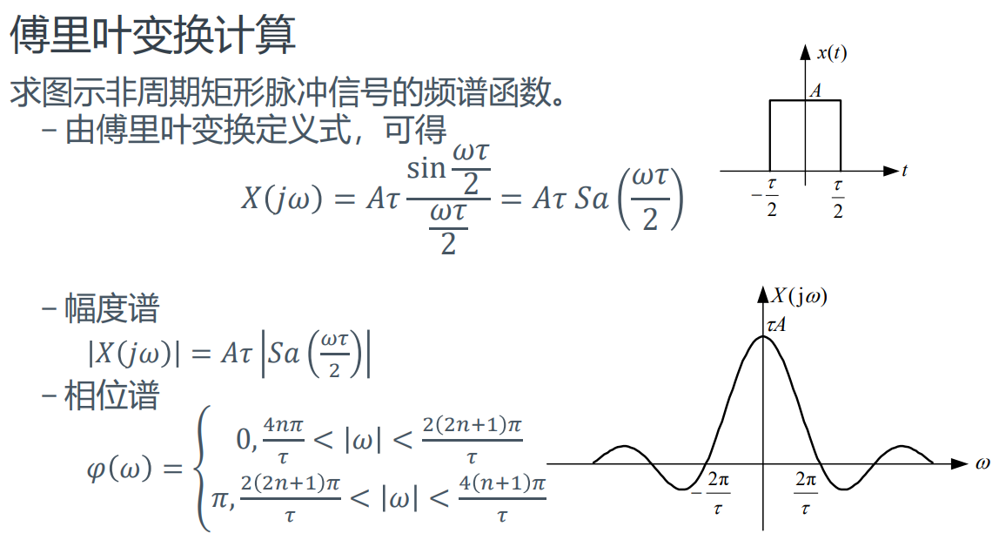
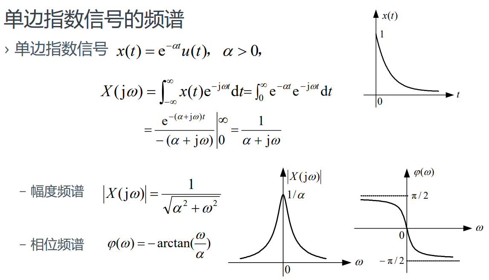
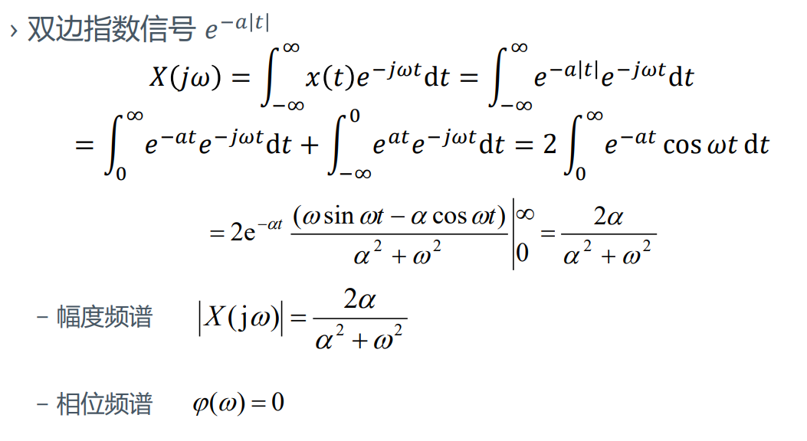
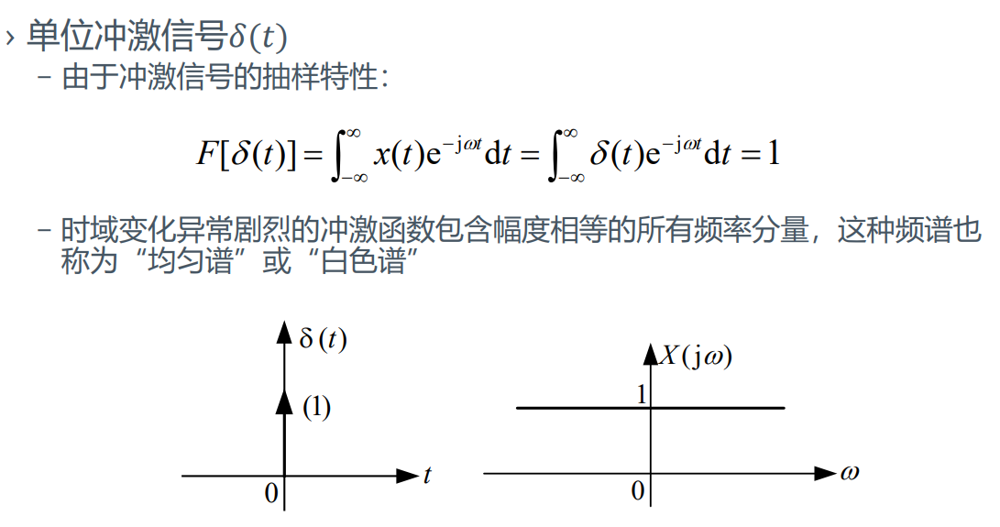
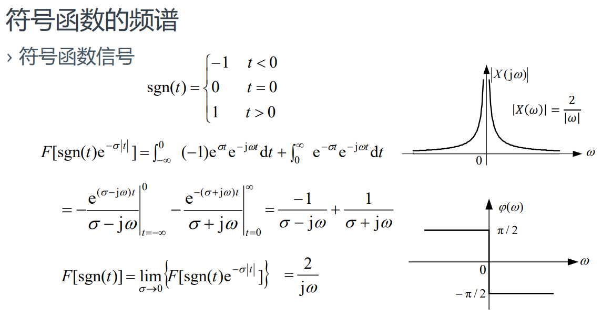
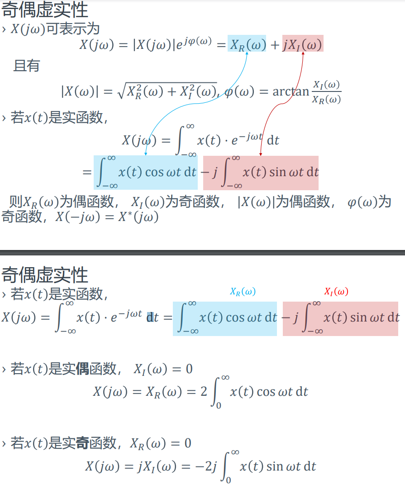

# 连续信号的傅立叶变换
> 如何将傅立叶级数推广到非周期信号？
> + 增大周期$T\to \infty$
>   + 信号近似非周期信号，谱线间隔$\omega\to 0$，离散频谱趋于连续频谱  
> 
>   + 这正是下面讨论的出发点

---
## 傅立叶变换
### 频谱密度
+ 重写傅立叶级数为
  $$x(t)=\sum_{n=-\infty}^{\infty}X(nj\omega)e^{jn\omega t}$$
  $$X(nj\omega)=\frac 1T\int_{-T/2}^{T/2}x(t)e^{-jn\omega t}dt$$
+ 两边乘以$T$
  $$TX(nj\omega)=\frac {X(nj\omega)2\pi}{\omega}=\int_{-T/2}^{T/2}x(t)e^{-jn\omega t}dt$$
  当$T\to \infty$时$TX(nj\omega)=\frac {X(nj\omega)2\pi}{\omega}$趋于有限值。
+ 定义**频谱密度函数**
  $$X(j\omega)=\lim_{T\to\infty}X(nj\omega )T=\lim_{\omega\to 0}\frac {X(nj\omega)2\pi}{\omega}$$
+ **频谱密度函数的直观理解**
  $\frac {X(nj\omega)}\omega$表示单位频带的频谱值，即频谱密度
  $$X(j\omega)=\lim_{T\to\infty}\int_{-T/2}^{T/2}x(t)e^{-jn\omega t}dt=\int_{-\infty}^{\infty}x(t)e^{-j\omega t}dt$$
+ **由频谱密度恢复$x(t)$**  
  

### 傅立叶变换
+ **傅立叶正变换**
  $$X(j\omega)=\mathcal{F}[x(t)]=\int_{-\infty}^{\infty}x(t)e^{-j\omega t}dt $$
+ **傅立叶逆变换**
  $$x(t)=\mathcal{F}^{-1}[X(j\omega)]=\frac 1{2\pi}\int_{-\infty}^{\infty} X(j\omega)e^{j\omega t}d\omega $$
+ **直观理解**
  + 非周期信号可以分解为无数个频率为$\omega$，复振幅为$\frac {X(j\omega)}{2\pi}d\omega$的虚指数信号的线性组合
  + $X(j\omega)$一般是复函数，可写作$X(j\omega)=|X(j\omega)|e^{j\phi(\omega)}$
    + $|X(j\omega)|-\omega$曲线为幅度频谱
    + $e^{j\phi(\omega)}-\omega$曲线为相位频谱
  + 傅立叶级数和傅立叶变换的关系
  $$X_n=\frac 1T X(j\omega)|_{\omega=n\omega}$$
### 收敛条件
+ 能量条件
+ 波形条件
  + 非周期信号在无限区间上绝对可积
  $$\int_{-\infty}^{\infty}|x(t)|dt<\infty$$
  + 在任意有限区间内，信号只有有限个最大值和最小值
  + 在任意有限区间内，信号仅有有限个不连续点，且这些点必须是有限值
+ 这里的条件是充分条件，而非必要条件

---
## 典型信号的傅立叶变换
### 非周期矩形脉冲信号

+ 非周期矩形脉冲信号的频谱的连续频谱，形状和矩形周期脉冲信号的离散频谱的包络线很相似
+ **若信号在时域有限，则将在频域无限延续**
+ 信号的频谱分量主要集中在0和第一个过零点之间，工程中往往将此宽度作为有效带宽
+ 脉冲宽度越窄，有效带宽越宽，高频分量越多，信号的信息量越大，传输速度越快，传送信号所占用的频带越宽

### 单边指数信号的频谱

### 双边指数信号的频谱

### 单位冲激信号的频谱

### 直流信号的频谱

### 符号函数的频谱

### 单位阶跃信号的频谱

---

## 傅立叶变换的性质
### 线性性
+ 若$x_1(t)\leftrightarrow_F X_1(j\omega), x_2(t)\leftrightarrow_F X_2(j\omega)$，则$ax_1(t)+bx_2(t)\leftrightarrow_F X_1(j\omega)+bX_2(j\omega)$

### 对称性
+ 若$x(t)\leftrightarrow_F X(j\omega)$，则$X(t)\leftrightarrow_F 2\pi x(-j\omega)$
  + 证明：
  由于
  $$
  x(t)=\mathcal{F}^{-1}[X(j\omega)]=\frac 1{2\pi}\int_{-\infty}^{\infty}e^{j\omega t}d\omega
  $$
  $$
  x(-t) = \frac 1{2\pi}\int_{-\infty}^{\infty}X(j\omega)e^{-j\omega t}d\omega
  $$
  将$t$和$j\omega$作形式上的代换，得到
  $$x(-j \omega)=\frac{1}{2 \pi} \int_{-\infty}^{\infty} X(t) e^{-j \omega t} \mathrm{d} t=\frac{\mathcal{F}[X(t)]}{2 \pi}$$
+ 若$x(t)$为偶函数，则$X(t)\leftrightarrow_F 2\pi x(j\omega)$

### 奇偶虚实性

### 尺度变换特性
+ 若$x(t) \stackrel{\mathcal{F}}{\leftrightarrow} X(j \omega)$，则$x(at)\stackrel{\mathcal{F}}{\leftrightarrow}\frac 1{|a|}X(j\omega/a)$
  + 若$a=-1$，则$x(-t)x(t) \stackrel{\mathcal{F}}{\leftrightarrow} X(j \omega) X(-j\omega)$，时域翻转则频域也翻转
  + 时域压缩，则频域拉伸；时域拉伸，则频域压缩

### 时移特性
+ 若$x(t)\stackrel{\mathcal{F}}{\leftrightarrow} X(j\omega)$，则$x(t-t_0)\stackrel{\mathcal{F}}{\leftrightarrow} X(j\omega)e^{-j\omega t_0}$

### 频移特性（调制定理）
+ 若$x(t)\stackrel{\mathcal{F}}{\leftrightarrow} X(j\omega)$，则
$$x(t)e^{j\omega_0 t}\stackrel{\mathcal{F}}{\leftrightarrow} X(j(\omega-\omega_0))$$

+ 一个例子
  $\begin{aligned}
  F[x(t)\cos w_0 t]&=\frac 12 F[x(t)e^{j\omega_0 t}]+\frac 12 F[x(t)e^{-j\omega_0 t}] \\
  &=\frac 12 X[j(\omega-\omega_0)]+\frac 12X[j(\omega+\omega_0)]
  \end{aligned}$
  信号$x(t)$乘以$\cos(\omega_0 t)$后，其频谱是将原来的信号向左右搬移$\omega_0$，幅度减半

### 时域积分特性
+ 若$x(t)\stackrel{\mathcal{F}}{\leftrightarrow} X(j\omega)$，则$\int_{-\infty}^t x(\tau)d\tau \stackrel{\mathcal{F}}{\leftrightarrow} \frac{X(j\omega)}{j\omega} + \pi X(0)\delta(w)$

### 时域微分特性
+ 若$x(t)\stackrel{\mathcal{F}}{\leftrightarrow} X(j\omega)$，则$\frac {d^nx(t)}{dt^n}\stackrel{\mathcal{F}}{\leftrightarrow} (j\omega)^n X(j\omega)$
+ 时域微分，频域使用$j\omega$增加高频
+ **若原信号中存在直流分量，那么在上述微分操作中直流分量将丢失，因此如果需要从导数的傅立叶变换中恢复出原信号的傅立叶变换，需要使用修正版本的时域微分**
  + $X(j\omega)=\pi[x(\infty)+x(-\infty)]\delta(\omega)+\frac {\mathcal{F}(x^{(n)})}{(j\omega)^n}$

### 频域微分特性
$$t^{n} x(t) \stackrel{\mathcal{F}}{\leftrightarrow} j^{n} \frac{\mathrm{d} X^{n}(j \omega)}{\mathrm{d} \omega^{n}}$$

### 时域卷积特性
+ 若$x_1(t)\stackrel{\mathcal{F}}{\leftrightarrow} X_1(j\omega)$，$x_2(t)\stackrel{\mathcal{F}}{\leftrightarrow} X_2(j\omega)$，则$x_1(t)*x_2(t)\stackrel{\mathcal{F}}{\leftrightarrow} X_1(j\omega)X_2(j\omega)$

### 频域卷积特性（调制特性）
+ 若
  $$x_{1}(t) \stackrel{\mathcal{F}}{\leftrightarrow} X_{1}(j \omega), x_{2}(t) \stackrel{\mathcal{F}}{\leftrightarrow} X_{2}(j \omega)X_2(j\omega)$$
+ 则
  $$x_{1}(t) \cdot x_{2}(t) \stackrel{\mathcal{F}}{\leftrightarrow} \frac{1}{2 \pi}\left[X_{1}(j \omega) * X_{2}(j \omega)\right]$$

### 非周期信号的能量谱密度
+ Parseval能量守恒
  $$ \int_{-\infty}^{\infty}|x(t)|^2dt=\frac 1{2\pi}\int_{-\infty}^{\infty}|X(j\omega)|^2d\omega $$
+ **物理意义**：非周期能量信号的归一化能量在时域和频域中相等，保持能量守恒。

> 傅里叶变换的性质总结  
> 

---
## 周期信号的傅里叶变换
+ 针对周期信号
  + 傅里叶级数为
  $$X_n = \frac 1T \int{t_0}^{t_0+T} x(t)\cdot e^{-jn\omega t}dt$$
  + 傅里叶变换
    + **周期信号不满足傅里叶变换的绝对可积条件**
      $$X(j\omega) = \int_{-\infty}^{\infty}x(t)\cdot e^{-j\omega t}dt $$
    + 但是在广义积分定义下，我们可以给出关于周期信号的傅里叶变换公式

### 典型周期信号的傅里叶变换
#### 正余弦信号