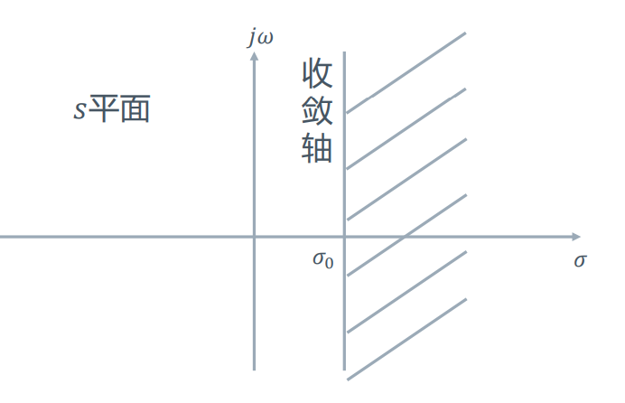
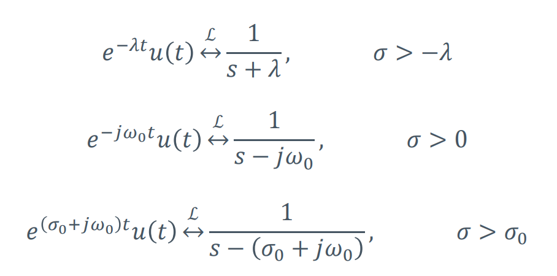
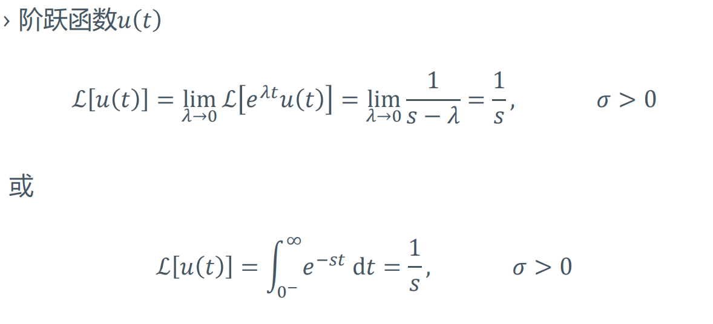
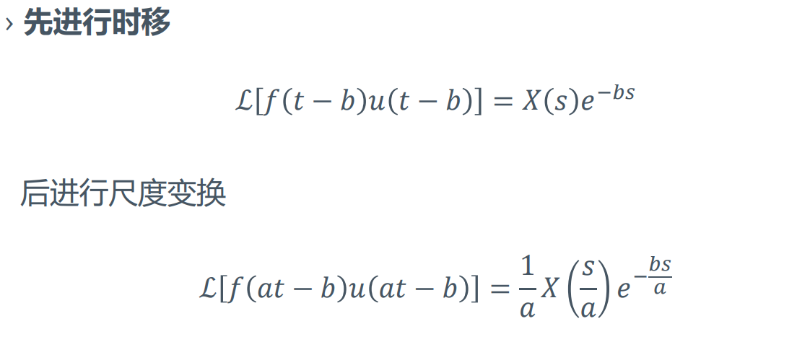
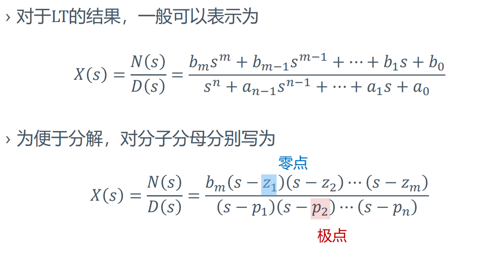

# 拉普拉斯变换及其应用
+ 对频率$\omega$概念的扩充
+ 傅里叶变换的缺陷
  + 表达信号受限制（不满足绝对可积条件）
  + 变换形式相对复杂
  + 分析系统有限制
  + 求解微分方程过程复杂
+ 拉普拉斯变换的优势
  + 将微分方程求解转换为代数方程，简化步骤
  + 指数函数等有不连续点的函数可以转换为简单的初等函数
  + 时域中的卷积变换为复频域中的乘积，建立了系统函数的概念
  + 利用系统函数零极点分布可以直观表达系统的很多特性

---
## 拉普拉斯变换
### 双边拉普拉斯变换
+ 针对一般信号$x(t)$
  $$
  \begin{aligned}
  \mathcal{F}[x(t)e^{-\sigma t}]&=\int_{-\infty}^{\infty} x(t)e^{-\sigma t}e^{-j\omega t}dt \\
  &= \int_{-\infty}^{\infty} x(t)e^{-(\sigma +j\omega)}dt\\
  &=\int_{-\infty}^{\infty} x(t) e^{-st}dt=X(s) \\
  &= \mathcal{L}[x(t)] \\
  \end{aligned}
  $$
+ 由$x(t)e^{-\sigma t}$的傅里叶反变换可以推出
  $$x(t)=\frac 1{2\pi j}\int_{\sigma-j\infty}^{\sigma+j\infty} X(s)e^{st}ds $$

+ 因此有
  + **拉普拉斯正变换（LT）**
  $$X(s)=\mathcal{L}[x(t)]=\int_{-\infty}^{\infty}x(t)e^{-st}dt $$
  + **拉普拉斯反变换**
  $$x(t)=\mathcal{L}^{-1}[X(s)]=\frac 1{2\pi j}\int_{\sigma-j\infty}^{\sigma+j\infty}X(s)e^{st}ds $$
  + **与傅里叶变换仅在逆变换的积分域上有所区别，正变换的形式完全相同。信号$x(t)$可以被分解为复指数$e^{st}$的线性组合，不同信号只是复指数$e^st$的系数$X(s)$不同。$X(s)$是复频率$s$的函数，称为复频谱。**

### 单边拉普拉斯变换
+ 单边拉普拉斯正变换
  $$X(s)=\int_{0_-}^{\infty}x(t)e^{-st}dt $$
  + 此时$x(t)$是因果信号
  + 从$0_-$开始积分，为了考虑$0$处的冲激值
+ 单边拉普拉斯反变换
  $$x(t)=\frac 1{2\pi j}\int_{\sigma-j\infty}^{\sigma +j\infty}X(s)e^{st}ds $$

### 单边拉普拉斯变换存在条件
+ 以单边为例，拉普拉斯变换存在的条件
  + 充分条件：绝对可积
  $$X(s)=\int_{0_-}^{\infty}|x(t)|e^{-\sigma t}dt=C<\infty $$
  + 对任意信号$x(t)$，若满足上式，则$x(t)$应满足
  $$\lim_{t\to \infty} x(t)e^{-\sigma t}=0$$
    + 称满足上述条件的$\sigma$下界为$\sigma_0$，为绝对收敛坐标  
    
+ 几个例子
  + 对于有限区间内、能量有限的信号，收敛区为整个复平面；有界非周期信号的LT一定存在。
  + 随时间的幂次增长的信号，收敛坐标位于原点
  $$\lim_{t\to\infty} t^ne^{-\sigma t}=0$$
  + 指数增长的信号，收敛坐标与$a$有关
  + 比指数增长更快的信号无法进行LT
+ 考虑到双边拉普拉斯变换需要对$t\to-\infty$的区域进行考虑，其收敛条件与形式往往较复杂。

---
## 常用信号的拉普拉斯变换
### 指数型函数$e^{\lambda t} u(t)$
$$ \mathcal{L}[e^{\lambda t}u(t)]=\int_{0_-}^{\infty}e^{\lambda t}e^{-st}dt=\frac 1{s-\lambda}\quad \quad \sigma > \lambda $$
+ 同理有  
  

### 冲激信号
$$ \mathcal{L}[\delta(t-t_0)]=\int_{0_-}^{\infty}\delta(t-t_0)e^{-st}dt=e^{-st_0}\quad\quad \sigma>-\infty $$

### 阶跃函数

### $t$的幂指数函数$t^n$

### 例子
+ 计算$x(t)=e^{-a(t+1)}u(t+1)$的LT
$$
\begin{aligned}
X(s)&=\int_{0_-}^{\infty}e^{-a(t+1)}u(t+1)e^{-st}dt\\
&=\int_{0_-}^{\infty}e^{-a}e^{-t(s+a)}dt\\
&=\frac{e^{-a}}{s+a}\quad\quad \sigma>-a
\end{aligned}
$$

---

## 单边拉普拉斯变换的性质
### 线性特性
+ 若$x_1(t)\stackrel{\mathcal{L}}{\leftrightarrow} X_1(s), \sigma>\sigma _1;x_2(t)\stackrel{\mathcal{L}}{\leftrightarrow} X_2(s),\sigma>\sigma_2$，则有
  $$a_1x_1(t)+a_2x_2(t)\stackrel{\mathcal{L}}{\leftrightarrow} a_1X_1(s)+a_2X_2(s)$$
  $$\sigma >\max(\sigma_1, \sigma_2)$$

### 展缩变换
+ 若$x(t)\stackrel{\mathcal{L}}{\leftrightarrow} X(s), \sigma >\sigma_0$，则
$$x(at)\stackrel{\mathcal{L}}{\leftrightarrow} \frac 1a X(\frac sa)\quad\quad \sigma>a\sigma_0,a>0$$

### 时移特性
+ 若$x(t)\stackrel{\mathcal{L}}{\leftrightarrow} X(s),\sigma>\sigma_0$，则
$$x(t-t_0)u(t-t_0)\stackrel{\mathcal{L}}{\leftrightarrow} e^{-st_0}X(s)\quad\quad\sigma >\sigma_0$$
  + 这里无论原始的$x(t)$在$0$前有没有值，时移后都要将$t_0$前的值置$0$，也就是乘以$u(t-t_0)$

> 已知$ \mathcal{L}[x(t)]=X(s)$，若$a>0, b>0$，求解$\mathcal{L}[f(at-b)u(at-b)]$
> 方法一  
> 
> 方法二  
> 

### 时域卷积特性
### 时域乘积特性
### 时域微分特性
### 时域积分特性

---
## 拉普拉斯变换和傅里叶变换的关系
+ 当收敛域包含$j\omega$轴时，拉普拉斯变换很傅里叶变换均存在
  $$X(j\omega)=X(s)|_{s=j\omega}$$
  + 可以认为当收敛域包含$j\omega$轴时，拉普拉斯变换令$\sigma=0$不需要配平也可以使得原信号收敛。
+ 当收敛域不包含$j\omega$轴时，拉普拉斯变换存在而傅里叶变换不存在
+ 当收敛域的收敛边界位于$j\omega$轴时，拉普拉斯变换和傅里叶变换均存在，且
  $$X(j\omega)=X(s)|_{s=j\omega}+\pi \sum_n K_n\delta(\omega-\omega_n)$$

---
## 单边拉普拉斯变换的反变换
+ 单边拉普拉斯变换的反变换
$$x(t)=\frac 1{2\pi j}\int_{\sigma-j\infty}^{\sigma_j\infty}X(s)e^{st}ds$$
+ 计算反变换的方法：
  + 复变函数中的留数定理
  + 部分分式展开法

### 部分分式展开法
+ 对于LT的结果，一般可以表示为  
