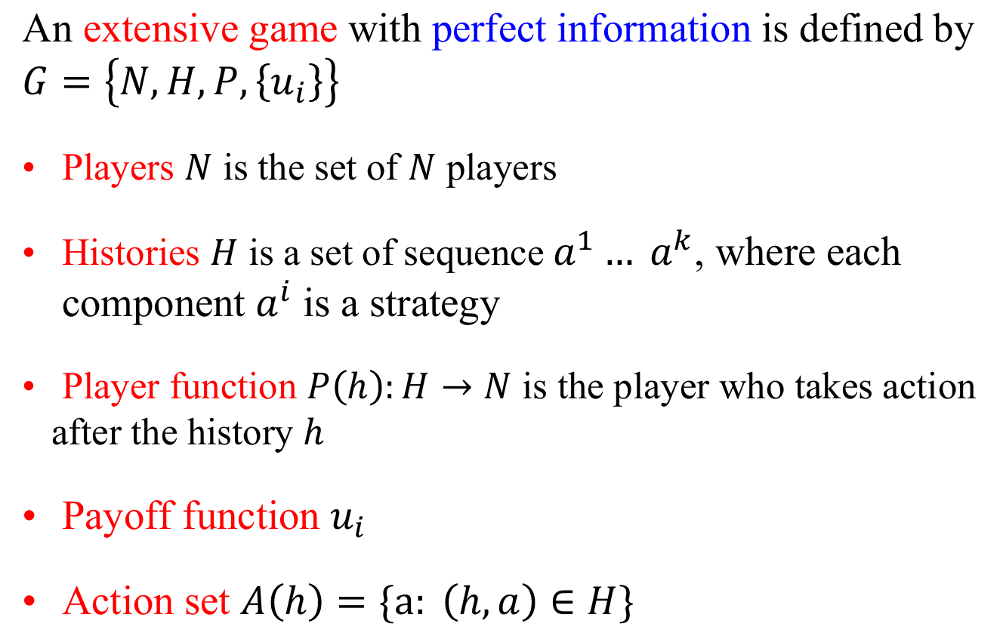
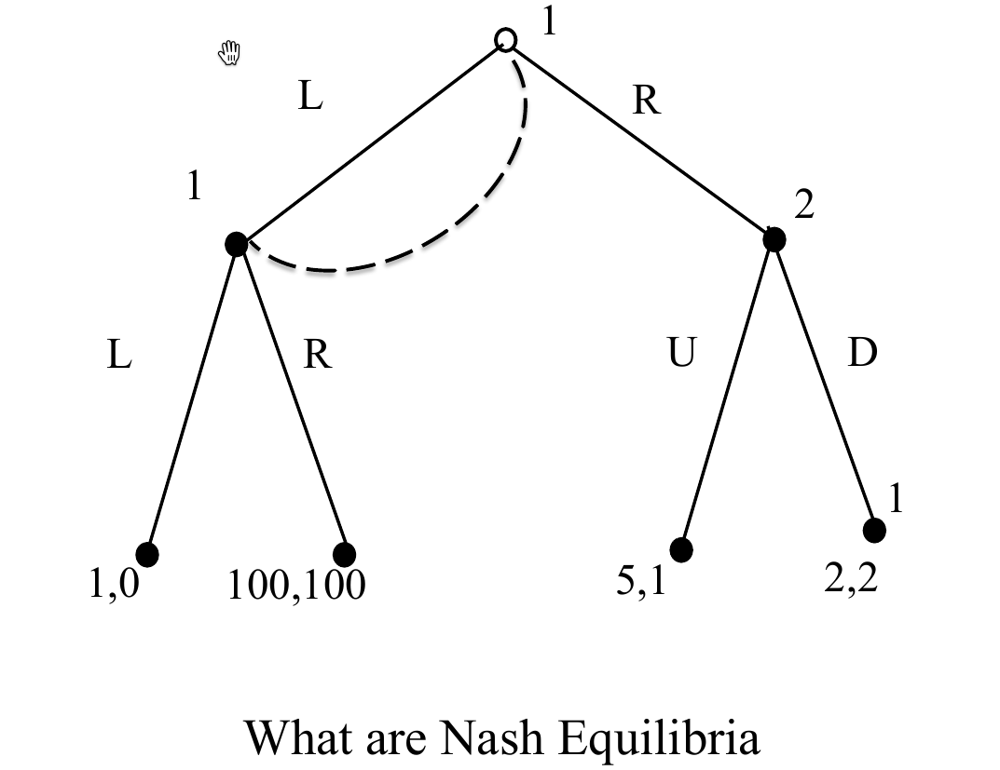

# Extensive Game with Imperfect Information
+ Motivation
  + 玩家不知道其他玩家采取的行动，或者
  + 自己无法回忆起自己在更早的时间刻作出的行动
+ 同时我们还可以将以前玩家同时作出决策的博弈建模成非完全信息的扩展式博弈

## Setting

### 常规扩展式博弈设置

+ 注意策略集的定义是在当前历史$h$下可以选择的动作

### 非完全信息下扩展式博弈的设置
+ 加入了信息集
  + **Information Set $I=\{I_1, I_2, ..., I_N\}$** is the set of information partition of all players' strategy nodes, where the nodes in an information set are **indistinguishable** to player
  + $I_i=\{I_{i1}, ..., I_{ik_i}\}$
  + $I_{i 1} \cup \cdots \cup I_{i k_{i}}=\{\text { all nodes of player } i\}$
  + $I_{i j} \cap I_{i k}=\emptyset \text { for all } j \neq \mathrm{k}$
  + Action set $A(h)=A(h')$ for $h, h'\in I_{ij}$, denoted by $A(I_{ij})$
  + $I_{ij}$是一个集合，含义就是对于玩家$i$来讲，在第$j$个时间步，他所无法区分的历史。如果是完全信息的扩展式博弈，那么这里的每个$I_{ij}$都只包含唯一的元素

> 

## 纯策略
+ 纯策略的定义为  
  
+ 例子
  
  注意这里对于player1，因为在第二个节点信息不完全，所以没有区分玩家2选择动作A或者动作B

## 求解均衡
+ 我们把求解非完全信息的扩展式博弈恢复成stage game，即可对PNE和MNE进行求解

> 
> 对于博弈玩家1，信息集为
> $$
\begin{aligned}
    I_1 = \{\{\emptyset, L\}\}
\end{aligned}
$$
> 对于博弈玩家2，信息集为
> $$
\begin{aligned}
    I_2 = \{\{R\}\}
\end{aligned}
>$$

## 完美回忆与非完美回忆
+ 对于一个扩展式博弈，如果每个玩家能够回忆自己在之前时间段作出的决策，那么就是一个完美回忆；否则为非完美博弈

> 非完美回忆的例子

### 完美回忆定义
+ Player $i$ has **perfect recall** in game $G$ if for any two history $h$ and $h'$ that are in the same information set for player $i$, for any path $h_0, h_1, ..., h_n, h$ and $h'_0, h'_1, ..., h'_m, h'$ from the root to $h$ and $h'$ with $P(h_k)=P(h'_k)=i$, we have
  + $n=m$
  + $h_i=h'_i\quad \text{for }1\leq i\leq n $
  + 也就是除了最后一个信息集中无法区分的$h, h'$，其他所有直达$h, h'$的历史序列上，与玩家$i$相关的节点的历史都是相同的

## 定义：混合策略和行为策略
+ **混合策略**：在所有的纯策略上添加分布
+ **行为策略**：A behavior strategy of player $i$ is an independent probability collection $\{\beta_{ik}(I_{ik})\}_{I_{ik}\in I_i}$, where $\beta_{ik}(I_{ik})$ is a probability distribution over $A(I_{ik})$
  + 行为策略就是在每个信息集后的行为集上添加一个分布
+ 性质
  + 混合策略不一定是行为策略
  + 在某些博弈之下，混合策略的均衡不一定是行为策略均衡，而行为策略均衡不一定是混合策略均衡

> 考虑 博弈
> 
> 如果只求解PNE，那么仅有唯一的PNE：(R, D)，发现博弈玩家1的$L->R$的奖赏再高也没有用
> 如果选择求解MNE，此时$L->R$就有用了
> 

## Kuhn Theorem
+ In an finite extensive game with **perfect recall**, 
  + any mixed  strategy of a player can be replaced by an equivalent behaviour strategy
  + any behavioral strategy can be replaced by an equivalent mixed strategy
  + Two strategies are equivalent
+ **Corollary**: In an finite extensive game with perfect recall, the set of NE does not change if we restrict ourselves to behavior strategies

> 例子：behaviour policy和mixed policy的相互转化
> 
> 