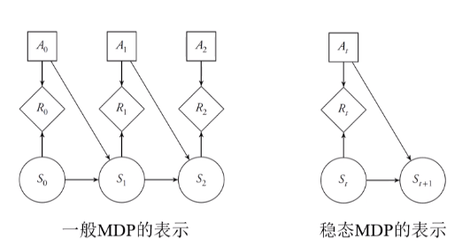
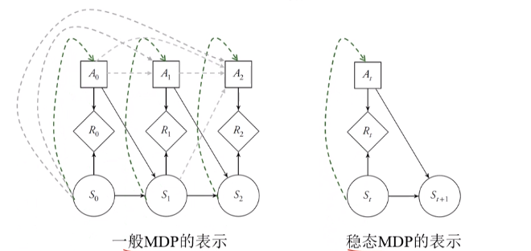
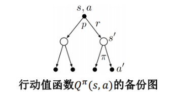
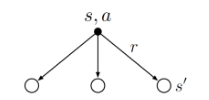
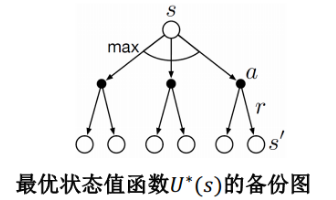
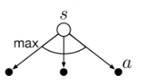
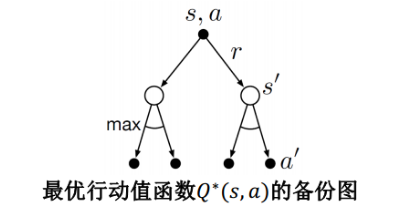
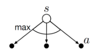

# 马尔科夫决策过程
---
## 问题描述方法
+ 在离散时刻$t=0, 1, ...$，Agent与环境的交互过程
  + Agent感知环境状态$S_t=s \in \mathcal{S} $，得到观察$O_t=o\in \mathcal{O} $
  + Agent根据观察做出行动$ A_t=a\in \mathcal{A} $
  + 环境根据Agent行动给予Agent奖赏$ R_t=r\in \mathcal{R} $，并进入下一步状态$ S_{t+1}=s'\in \mathcal{S} $
  + **轨道**：一个时间离散化Agent-环境交互过程可以用轨道表示
    + $ S_0, O_0, A_0, R_0, S_1, O_1, ... $
+ 环境性质对Agent反馈的影响
  + 如果环境是完全可观察的，则Agent得到的是真实的状态
  + 如果环境是部分可观察的，则Agent得到的是观察

---
## 马尔科夫决策

### 完全可观察任务
+ 完全可观察前提下有：$O_t=S_t$
+ 轨道形式
  + 无限步数：$S_0, A_0, R_0, S_1, A_1, ...$
  + 有限步数：$S_0, A_0, R_0, S_1, A_1, ..., S_T=s_{\text{terminate}}$

### 马尔科夫假设
+ 给定过去时刻的轨道$S_0, A_0, ...., S_t, A_t$，状态$S_{t+1}$和奖赏$R_t$仅依赖于当前状态$S_t$和行动$A_t$，与更早的行动无关，即
  $\mathrm{P}\left(S_{t+1}=s^{\prime}, R_{t}=r | S_{t}=s, A_{t}=a\right)$

### 马尔科夫决策过程 （Markov Decision Process， MDP）
+ 构成
  + 状态空间$ \mathcal{S} $
  + 行动空间$ \mathcal{A} $
  + 奖赏空间$ \mathcal{R} $
  + 动力函数
  $$P\left(S_{t+1}, R_{t} | S_{t}, A_{t}\right): \mathcal{S} \times \mathcal{R} \times \mathcal{S} \times \mathcal{A} \rightarrow[0,1]$$
  + 状态转移函数
  $$P\left(S_{t+1} | S_{t}, A_{t}\right)=\sum_{r \in \mathcal{R}} P\left(S_{t+1}, R_{t}=r | S_{t}, A_{t}\right)$$
  + 奖赏函数
  $$P\left(R_{t} | S_{t}, A_{t}\right)=\sum_{s^{\prime} \in \mathcal{S}} P\left(S_{t+1}=s^{\prime}, R_{t} | S_{t}, A_{t}\right)$$
  + 奖赏函数和状态转移函数实际上就是动力函数的边际分布

### 稳态马尔科夫决策过程 （MDPs）
+ 动力函数与$t$无关
+ 因而
  + 动力函数
  $$p\left(s^{\prime}, r | s, a\right)=P\left(S_{t+1}=s^{\prime}, R_{t}=r | S_{t},=s A_{t}=a\right)$$
  其中$P(S_{t+1}, R_t|S_t, A_t)$为稳态分布
  + 状态转移函数
  $$ T(s'|s, a)=p(s'|s, a)=\sum_{r\in \mathcal{R}}p(s', r|s, a) $$
  + 奖赏函数
  $$p(r|s, a)=\sum_{s'\in \mathcal{S}}p(s', r|s, a)$$
  + **给定(s, a)的期望奖赏函数**
  $$R(s, a) = \sum_{r\in \mathcal{R}}r\cdot p(r|s, a)$$
  + **给定(s, a, s')的期望奖赏函数**
  $$R(s, a, s')=\sum_{r\in \mathcal{R}}r\cdot p(r|s, a, s')=\sum_{r\in \mathcal{R}}r\frac{p(s', r|s, a)}{p(s'|s,a)}$$

### MDP的决策网络表示

+ 上图表示中省去了影响决策节点的信息边。事实上，只有从$S_t$到$A_t$的信息边（绿色）是有信息传递的，其余信息边（灰色）由马尔科夫假设可知是冗余的

### MDP决策网络中的效用和奖赏
+ MDP中的奖赏节点可被视作一个加法效用函数的组件，总的效用被分解为奖赏$R_{0:t}$
+ **效用可看作对多步行动后总场面的一种评估，而奖赏则是单步行动导致的效用的增益**
+ 有限步的n步决策问题
  + $\text{效用}=\sum_{t=0}^{n-1}R_t$
+ 无限步的决策问题
  + 用折扣奖赏定义效用：$\sum_{t=1}^\infty \gamma^tR_{t}$
  + 用平均奖赏定义效用：$\lim\limits_{n\to\infty}\frac 1n\sum_{t=0}^{n-1}R_t$
  + 本课程主要使用基于折扣奖赏的无限步数决策问题

---
## 策略和值函数

### 策略
+ 策略$\pi_t(h_t)$：给定历史$h_t=(s_{0:t}, a_{0:t})$，确定行动
+ 在MDP问题中，策略简化为$\pi_t(s_t)$
+ **有限步数MDPs**：状态中还应当包含剩余步数
+ MDPs的策略
  + 随机性策略
    + $\pi(a|s)=P(A_t=a|S_t=s)\ \ \ \ \ \ s\in \mathcal{S}, a\in \mathcal{A} $
  + 确定性策略
    + 对任意的$ s\in \mathcal{S} $，均存在一个$a\in \mathcal{A} $，使得在状态$s$下Agent一定采取行动$a$

### 折扣回报
+ 考虑问题为基于折扣奖赏的无限步数MDP问题
+ **时刻$t$的折扣回报**
  + 从时刻$t$起，Agent将得到的折扣奖赏之和
  $G_t\doteq R_t+\gamma R_{t+1}+\gamma^2R_{t+2}+...=\sum\limits_{k=0}^\infty\gamma^kR_{t+k}$
  + 因而有
  $G_t = R_t+\gamma G_{t+1}$

### 状态值函数
+ **状态值函数$U^\pi(s)$**：从状态$s$起，执行策略$\pi$的期望回报
  $$U^{\pi}(s) \doteq \mathbb{E}_{\pi}\left[G_{t} | S_{t}=s\right]=\mathbb{E}_{\pi}\left[\sum_{k=0}^{\infty} \gamma^{k} R_{t+k} | S_{t}=s\right], \text { for all } s \in \mathcal{S}$$
+ **Bellman期望方程**
  $U^\pi(s)\doteq \mathbb{E}_\pi[G_t|S_t=s] $
  $= \mathbb{E}_{\pi}[R_t+\gamma G_{t+1}|S_t=s] $
  $=\sum\limits_{a}\pi(a|s)\sum\limits_{s'}\sum\limits_{r}p(s', r|s, a)\left(r+\gamma \mathbb{E}_\pi[G_{t+1}|S_{t+1}=s'] \right)$
  $=\sum\limits_{a} \pi(a | s) \sum\limits_{s^{\prime}, r} p\left(s^{\prime}, r | s, a\right)\left[r+\gamma U^{\pi}\left(s^{\prime}\right)\right], \quad \text { for all } s \in \mathcal{S}$
  $=\sum\limits_a\pi(a|s)[R(s, a)+\gamma\sum\limits_{s'}T(s'|s, a)U^\pi(s')]$
  即
  $$U^\pi(s)=\sum\limits_a\pi(a|s)[R(s, a)+\gamma\sum\limits_{s'}T(s'|s, a)U^\pi(s')]$$
  特殊地，当$\pi$为确定性策略时，有
  $$U^\pi(s)=R(s, \pi(s))+\gamma\sum\limits_{s'}T(s'|s, \pi(s))U^\pi(s')$$

+ 例子：5*5栅格世界  

### 状态值函数的备份图
+ 空心节点表示状态，实心节点表示行动  

+ 备份图可被拆分为两个子图，对应两个迭代方程
  + $U^\pi (s)=\sum\limits_{a}\pi(a|s)Q^\pi(s, a)$  
    
  + $Q^\pi(s, a)=\sum\limits_{s', r}p(s', r|s, a)[r+\gamma U^\pi(s')]$  
    

### 动作值函数
+ **动作值函数$Q^\pi(s, a)$**：在状态$s$采取行动$a$后，执行策略$\pi$的期望回报
  $$ Q^{\pi}(s, a) \doteq \mathbb{E}_{\pi}\left[G_{t} | S_{t}=s, A_{t}=a\right]=\mathbb{E}_{\pi}\left[\sum_{k=0}^{\infty} \gamma^{k} R_{t+k} | S_{t}=s, A_{t}=a\right] $$
+ **Bellman期望方程**
  $Q^\pi(s, a)\doteq \mathbb{E}_\pi[G_t|S_t=s, A_t=a] $
  $=\mathbb{E}_\pi[R_{t+1}|S_t=s, A_t=a]+\gamma \mathbb{E}_{\pi}[G_{t+1}|S_t=s, A_t=a] $
  $=\sum\limits_{s', r}p(s', r|s, a)+\gamma\sum\limits_{s', r}p(s', r|s, a)\sum\limits_{a'}\pi(a'|s')\mathbb{E}_\pi[G_{t+1}|S_{t+1}=s', A_{t+1}=a'] $
  $=\sum\limits_{s' ,r}p(s', r|s, a)[r+\gamma\sum\limits_{a'}\pi(a'|s')Q^\pi(s'|a')]$
  $=R(s, a)+\gamma T(s'|s, a)\sum\limits_{a'}\pi(a'|s')Q^\pi(s'|a')$
  即
  $$Q^\pi(s, a)=R(s, a)+\gamma T(s'|s, a)\sum\limits_{a'}\pi(a'|s')Q^\pi(s'|a')$$

### 动作值函数的备份图

+ 备份图可被拆分为两个子图，对应两个迭代方程
  + $Q(s, a) = \sum\limits_{s', r}p(s', r|s, a)[r+\gamma U^\pi(s')]$  
  
  + $U^\pi(s)=\pi(a|s)Q^\pi(s, a)$
  
  
---
## 最优策略和最优值函数

### 最优策略
+ **策略的偏序关系$\leq$**：对两个策略$\pi$,$\pi'$，如果对$\forall s\in \mathcal{S} $，都有$ U^\pi(s)\leq U^{\pi'}(s) $，则记$\pi\leq\pi'$
+ **最优策略$\pi^*$**
  + （最优性）对于一个动力函数，所有的策略$\pi$都有$\pi\leq\pi^*$
  + （确定性）$\pi^*$满足  
  

### 最优状态值函数
+ 由于状态值函数由策略决定，因此最优策略可通过寻找最优状态值函数的方法获得
+ **最优状态值函数$U^*(s)$**：从状态$s$起，执行最优策略$\pi^*$的期望回报$U^*(s)\doteq \max\limits_{\pi}U^\pi(s)\ \ \ \ \ \ \text{for all }s\in \mathcal{S} $
+ **Bellman最优方程**
  $U^*(s)=\max\limits_{a\in \mathcal{A}(s)}Q^*(s, a)$
  $=\max\limits_{a} \mathbb{E}_{\pi^*}[G_t|S_t=s, A_t=a] $
  $=\max\limits_{a} \mathbb{E}_{\pi^*}[r+\gamma G_{t+1}|S_t=s, A_t=a]$
  $=\max\limits_a \sum\limits_{s', a}p(s', r|s, a)[r+\gamma U^*(s')] $
  $=\max\limits_{a}(R(s, a)+\gamma\sum\limits_{s'} T(s'|s, a)U^*(s'))$ 
  即
  $$U^*(s)=\max\limits_{a}(R(s, a)+\gamma\sum\limits_{s'} T(s'|s, a)U^*(s'))$$
+ 从Bellman最优方程迭代中选择出的一系列$a$即可构成最优策略$\pi^*$
+ **最优**的体现就在于对行动$a$的选择上

### 最优状态值函数的备份图

+ 可被分解为两个子图，对应两个迭代方程
  + $U^*(s)=\max\limits_{a\in \mathcal{A}(s) }Q^*(s, a)$  
  
  + $Q^*(s, a)=\sum\limits_{s', r}p(s', r|s, a)[r+\gamma U^*(s')]$  
  

### 最优动作值函数
+ **最优动作值函数$Q^*(s, a)$**：在状态$s$采取行动$a$后，执行最优策略$\pi^*$的期望回报$Q^*(s, a)\doteq\max\limits_\pi Q^\pi(s, a)\ \ \ \ \ \ \text{for all }s\in \mathcal{S}, a\in \mathcal{A} $
+ 而事实上，动作值函数中的动作已经确定，因而其最优性体现在对于$s$之后的状态，每次都选择最优的动作，即$Q^*(s, a)=\sum\limits_{s', r}p(s', r|s, a)[r+V^*(s')]$
+ **Bellman最优方程**
  $Q^*(s, a)= \mathbb{E}_{\pi^*}[R_t+\gamma V^*(S_{t+1})|S_t=s. A_t=a] $
  $= \mathbb{E}_{\pi^*}[R_t+\gamma\max\limits_{a'}Q^*(S_{t+1}, a')|S_t=s, A_t=a] $
  $=\sum\limits_{s', a}p(s', r|s, a)[r+\gamma \max\limits_{a'}Q^*(s', a')]$
  $=R(s, a)+\gamma T(s'|s, a)\max\limits_{a'}Q^*(s', a')$
  即
  $$Q^*(s, a)==R(s, a)+\gamma T(s'|s, a)\max\limits_{a'}Q^*(s', a')$$

+ *注：始终注意：1）期望 $ \mathbb{E}_{\pi} $ 在只给定状态 $s$ 和给定 $s$ 和 $a$ 情况下的不同展开；2）最优性永远体现在对动作的选择具备确定性（唯一性）*

### 最优动作值函数的备份图

+ 子图和对应迭代方程
  + $Q^{*}(s, a)=\sum_{s^{\prime}, r} p\left(s^{\prime}, r | s, a\right)\left[r+\gamma U^{*}\left(s^{\prime}\right)\right]$  
  
  + $U^{*}(s)=\max _{a \in \mathcal{A}(s)} Q^{*}(s, a)$  
  