# 强化学习
+ 状态转移模型、奖赏模型未知
+ 智能体需要从经验中学习
+ 面对三方面挑战
  + 探索与利用（Exploraion and Exploitation）
  + 信度分配（Credit Assignmnet）
    + 奖赏具有延迟性，需要把奖赏的信度分配给早些作出的、具有重要作用的决策
  + 泛化（Generalization）
---
# 目录
[TOC]
---
## 探索与利用

### n-摇臂赌博机
+ 问题描述
  + 有n个摇臂，赌徒在投入一个硬币后可选择拉下其中一个摇臂
  + 每个摇臂 $i$ 以一定概率 $\theta_i$ 吐出硬币，但概率未知
  + 总共能拉h次摇臂
  + **目标**：通过一定策略最大化自己的奖赏
+ 问题分析
  + 在n0摇臂赌博机模型中，探索体现在估计摇臂的优劣，利用体现在选择当前自认为最好的摇臂

### 利用
+ 在已有一定探索经验的前提下，利用探索经验作出决策（即评估各摇臂好坏）

#### n-摇臂赌博机：极大似然估计
+ 设在摇臂$i$上获胜的次数为$w_i$，失败的次数为$l_i$，则由极大似然估计，将认定$\theta_i=\frac{w_i}{w_i+l_i}$

#### n-摇臂赌博机：贝叶斯模型估计
+ 使用均匀分布$ \mathrm{Beta}(1,1) $作为$\theta_i$的先验分布
+ 对摇臂$i$，记录获胜次数$w_i$和失败次数$l_i$，则$\theta_i$的后验分布为$ \mathrm{Beta}(w_i +1, l_i+1) $
+ 由后验分布可进一步推知摇臂$i$上获胜的后验概率为
  $$\rho_{i}=P\left(\operatorname{win}_{i} | w_{i}, \ell_{i}\right)=\int_{0}^{1} \theta_{i} \times \operatorname{Beta}\left(\theta_{i} | w_{i}+1, \ell_{i}+1\right) d \theta_{i}=\frac{w_{i}+1}{w_{i}+\ell_{i}+2}$$

> 例子
> 

### 探索
+ **无向的探索策略**：不使用之前的行动结果信息来指导非贪心行动的选择
+ **有向的探索策略**：使用之前的行动结果信息来指导非贪心行动的选择

#### 贪心（无探索策略）
+ **真实行动值**：在$t$时刻选择行动$a$的期望奖赏
  $$q^*(a)\doteq \mathbb{E}[R_t|A_t=a] $$
+ **行动值**：在$t$时刻之前，选择行动$a$的平均奖赏
  $$Q_t(a)=\frac{\sum_{i=1}^{t-1}R_i\cdot \mathbb{I}(A_i=a)}{\sum_{i=1}^{t-1} \mathbb{I}(A_i=a)}$$
  + 使用行动值作为对真实行动值的估计
+ **贪心**：在$t$时刻，选择使行动值$Q_t(a)$最大的行动
  $$A_t\doteq \argmax_a Q_t(a)$$

#### 无向的探索策略

##### $\epsilon$贪心
+ 基于概率值$\epsilon$来对探索和利用进行折中
+ 以$\epsilon$的概率随机选择一个摇臂，以$1-\epsilon$的概率选择摇臂$\argmax_i Q_t(i)$

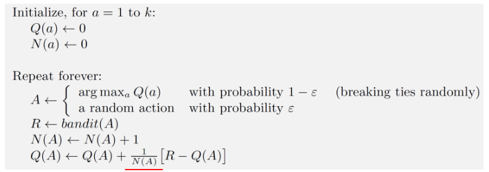

##### 乐观初始化
+ 给所有初始行动值估计$Q_1(a)$一个乐观值（较大的值），鼓励对未探索过的或者探索次数比较少的行动进行探索

#### 有向的探索策略

##### 上置信界探索（UCB）
+ 区间探索：计算$q^*(a)$的$\alpha \%$置信区间，选择上置信界最大的摇臂
  + $\alpha$越大，探索程度越高
+ 上置信界（UCB）行动选择
  $$A_{t} \doteq \underset{a}{\operatorname{argmax}}\left[Q_{t}(a)+c \sqrt{\frac{\ln t}{N_{t}(a)}}\right]$$

##### 随机梯度上升
+ $H_t(a)$：对行动$a$的偏好程度
+ 根据软最大化分布选择行动
  $$\operatorname{Pr}\left\{A_{t}=a\right\} \doteq \frac{e^{H_{t}(a)}}{\sum_{b=1}^{k} e^{H_{t}(b)}} \doteq \pi_{t}(a)$$
+ 在每一步采取行动$A_t$得到奖赏$R_t$后，更新偏好
  $$H_{t+1}\left(A_{t}\right) \doteq H_{t}\left(A_{t}\right)+\alpha\left(R_{t}-\bar{R}_{t}\right)\left(1-\pi_{t}\left(A_{t}\right)\right)$$
  $$H_{t+1}(a)\doteq H_t(a)-\alpha(R_t-\bar{R}_t)\pi_t(a), \quad \text{for all }a\not =A_t$$
  + 其中，$\bar{R}_t$是一个人为规定的基准项

### 最优探索策略
+ 信念状态
  + 计数$w_1, l_1, ..., w_n, l_n$分别所有摇臂的获胜次数、失败次数
  + 用作一个表示n-摇臂赌博机问题的MDP状态
+ 动态规划
  + 使用动态规划确定最优策略$\pi^*$，输入为$w_{1:n}, l_{1:n}$，输出为作出的决策摇臂$i$
  + 定义$Q^*(w_{1:n}, l_{1:n}, i)$为拉摇臂$i$，然后执行最优行动得到的期望回报
  + 则最优状态值函数$U^*(w_{1:n}, l_{1:n})$和最优策略$\pi^*(w_{1:n}, l_{1:n})$为
  $$U^*(w_{1:n}, l_{1:n})=\max_i Q^*(w_{1:n}, l_{1:n}, i)$$
  $$\pi^*(w_{1:n}, l_{1:n})=\argmax_i Q^*(w_{1:n}, l_{1:n}, i)$$
  + 有$Q^*$的迭代式
  $$Q^*(w_{1:n}, l_{1:n}, i)=\frac{w_i+1}{w_i+l_i+2}(1+U^*(..., w_i+1, l_i, ...))+\frac{l_i+1}{w_i+l_i+2}U^*(...,w_i, l_i+1,...)$$
    在有限步数$\sum_i(w_i+l_i)=h$时，有$U^*(w_{1:n}, l_{1:n})=0$  
    然后可计算出所有$\sum_{i}(w_i+l_i)=h-1$的信念状态的$U^*$  
    ...  
    依次进行，直到计算完$\sum_{i}(w_i+l_i)=0$的信念状态的$U^*$  
    总的时空复杂度为$O(\frac{2^hn^h}{h!})$

---
## 基于模型的强化学习方法
+ 模型和规划
  + 模型: 可以用于预测环境如何对Agent的行动作出响应(给出奖赏, etc)
    + **具体到本章节所讲的问题中, 模型就是转移函数$T$和奖赏函数$R$**
    + 分布模型: 在任意状态, 转移到下一状态和所得奖赏的概率分布
    + 样本模型: 从下一个状态和立即奖赏的概率分布中产生一个样本状态和样本奖赏
  + 规划: 以模型为输入, 输出一个策略的计算过程
    + **规划实际上就是基于给定的模型, 导出动作值函数$Q(s, a)$**
+ **model-based** or **model-free** ?
  + 基于模型的方法实际上在从Agent的经验中进行model learning, 然后通过规划导出策略, 这在gridworld等以规则为核心的系统中效果较好. 但是缺点是模型的表示本身与真实环境相比有一定误差. 下图是model-based算法的一般流程  
  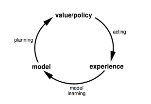
  + model-free方法仅从Agent的过去的探索中**直接学习策略**, 当环境的模型化十分困难 (比如奖赏较难建模的围棋系统) 时, model-free的思想会有一定帮助
+ 考虑有多个状态的强化学习问题
  + 与n-摇臂赌博机问题一样,对状态转移, 奖赏的模型未知
  + 相比n-摇臂赌博机问题, 需要进行对访问各状态的顺序进行**规划**
  + 相比n-摇臂赌博机问题, 行动不仅有立即奖赏,还会影响后续状态
+ 下面讨论两种基于模型的方法
  + 极大似然方法方法
    + 模型($T, R$)的学习采用极大似然方法
  + 贝叶斯方法
    + 模型($T, R$)的学习采用贝叶斯方法

### 极大似然方法

#### 算法框架
+ **算法核心**: 从经验中估计转移模型和奖赏模型
$$N(s, a)=\sum_{s'}N(s, a, s')$$
$$T(s'|s, a)=N(s, a, s')/N(s, a)$$
$$R(s, a)=\rho(s, a)/N(s, a) \quad \rho\text{为经验中的奖赏之和}$$

+ 算法第6-7行实际上是experience的过程, 第8-10行是model-learning的过程, 而第6行实际上是基于当前估算的模型, 结合一定的探索策略作出决策
+ 下面所讨论的各种算法, 本质上区别都是在于第10行的处理

#### Dyna算法: Randomized Updates
+ 第10行, 每次迭代都去求解MDP问题的开销过大, 可对当前节点的Q使用增量更新
$$Q(s, a)\leftarrow R(s, a)+\gamma\sum_{s'}T(s'|s, a)\max_{a'}Q(s', a')\quad\quad\Rightarrow$$
$$Q(s, a)\leftarrow Q(s, a)+\alpha(r+\gamma\max_{a'}Q(s', a')-Q(s, a))$$
+ 然后随机选取一些之前出现过的状态和行动, 更新这些状态-行动对上的Q值(可能需要用到样本模型和规划方法)
+ 更新后, 使用某一探索策略(比如softmax策略)选择行动

#### Q-planning算法
+ 可用于算法框架的第10行, 用于更新Q值
+ **特点**: 需要给定一个样本模型作为输入

#### Dyna-Q算法
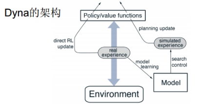

+ 结合了Dyna算法和Q规划
+ 会初始化一个样本模型.算法的每一次迭代分为两步
  + 在一个状态处进行一步行动, 根据奖赏和下一个状态更新模型Model (真实的经验, 同时用于模型的学习和值函数Q的更新)
  + 根据模型来采样n组之前出现过的状态-行动对, 更新这些状态上的Q (仿真的经验, 仅用于更新Q, 导出策略)

#### Dyna-Q+算法
+ Dyna-Q+: 使用了探索奖金以鼓励探索.
  + 设$\tau$为与最后一次探索某转移的时间间隔, 则reward变为$r+\kappa \sqrt{\tau}$
+ 鼓励探索的Dyna-Q+算法在有变化的环境中能获得更好的性能

#### Prioritized Sweeping算法
+ 使用一个优先队列来帮助鉴别最需要更新U值的状态

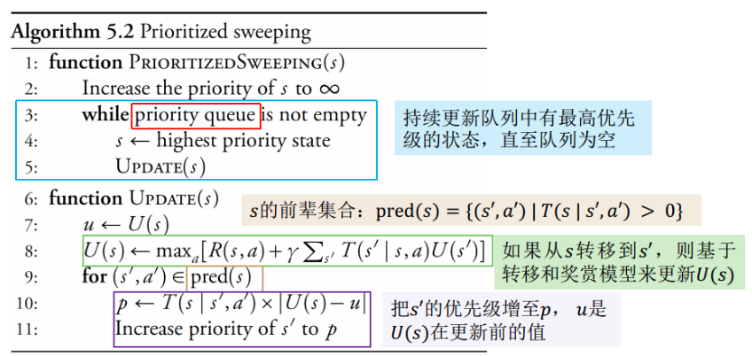

#### Dyna with Prioritized Sweeping Q-planning
+ 与Dyna-Q的区别在于仿真过程, 使用优先队列来选择进行更新Q值的状态, 而不是从样本模型中随机采样
+ 一般情况下收敛到最优解所需要的更新次数更少 (数量级上的差异)

### 基于贝叶斯模型的方法
+ 贝叶斯方法下的模型参数
  + 简单起见, 这里只考虑状态转移概率的参数
  + 参数向量$\theta$有$|\mathcal{S}|^2|\mathcal{A}|$个元素: $\theta_{(s, a, s')}=T(s'|s, a)$
  + **需要指定模型参数$\theta$的一个先验分布**
+ 可以使用动态决策网络表示问题的结构
  + 其中, 状态节点可以观察, 而参数节点不可观察
  + **一般情况下, 默认参数$\theta$不随时间改变, 但是其信念状态会随着转移到新的状态而发生变化**
  
  

#### 模型参数的信念状态
+ $\theta$的先验信念状态: $b_0$
  + 对于离散状态空间, $\theta$的信念状态为
  $$b_0(\theta)=\prod_s\prod_a \mathbf{Dir}(\theta_{(s, a)}|\alpha_{(s, a)}) $$
  + $\alpha_{(s, a)}$为给定状态$s$和动作$a$后转移到下一状态$s'$的Dirichlet参数向量, 长度为$|\mathcal{S}|$
  + 如果是均匀先验分布, $\alpha_{(s, a)}$均为1
  + 如果有先验知识, $\alpha_{(s, a)}$中的值设置为不同值
+ $\theta$的后验信念状态: $b_t$
  + 设$ \mathbf{m}_{(s, a)} $为$|\mathcal{S}|$维向量, 各元素表示在前$t$步, 观察到从$s$采取行动$a$转移到各个$s'$的次数, 此时有
  $$b_t(\theta)=\prod_s\prod_a \mathbf{Dir}(\theta_{(s, a)}|\alpha_{(s, a)}+\mathbf{m}_{(s, a)}) $$

#### 贝叶斯自适应MDPs
+ **核心思想: 把一个模型未知的基础MDP问题形式化为模型已知的, 更高维的贝叶斯自适应MDP问题**
+ 设基础MDP问题的状态空间为$ \mathcal{S} $, 行动空间为$ \mathcal{A} $, 奖赏函数为$R$但未知
+ 贝叶斯自适应MDP问题的形式为
  + 状态: $(s, b)\in \mathcal{S}\times \mathcal{B} $
    + $s$是基础MDP的状态, $b$是信念状态
    + 其中$ \mathcal{B} $是模型参数$\theta$的所有可能信念状态构成的空间
  + 行动空间$ \mathcal{A} $, 奖赏函数与基础MDP相同
  + 转移函数 $T(s', b'|s, b, a)=\delta_{\tau(s, b, a, s')}(b')P(s'|s, b, a)$
    + 其中, $\delta_x(y)$为Kronecker函数, 仅在$x=y$时为1, 其余值为0
    + $\tau(s, b, a, s')$是$s, b, a, s'$的确定性函数, 由贝叶斯规则算出
    + $P(s'|s, b, a)=\int_\theta b(\theta)P(s'|s, \theta, a)d\theta=\int_\theta b(\theta)\theta_{(s, a, s')}d\theta$
+ **求解方法**
  + 方法一: 把Bellman最优方程从模型已知的MDPs泛化到模型未知的情形
  $$U^{*}(s, b)=\max _{a}\left(R(s, a)+\gamma \sum_{s^{\prime}} P\left(s^{\prime} | s, b, a\right) U^{*}\left(s^{\prime}, \tau\left(s, b, a, s^{\prime}\right)\right)\right)$$
  由于$b$是连续值, 因而不能直接值迭代求解. 可用近似方法/第6章节的POMDP方法来求解
  + 方法二: **汤普森采样**
    + 从当前的信念状态$b_t$中抽取一个样本$\theta$
    + 假设$\theta$是真实的模型, 动态规划来求解最好的行动
    + 在下一个time step, 更新信念状态, 抽取一个新样本, 重新求解MDP

---
## 免模型的强化学习方法
+ 不对问题的转移概率和奖赏进行显式建模, 而依靠过去探索的经验来直接学习策略
+ 当环境模型的表示十分困难时, model-free的方法是很有帮助的
+ **一般而言, 强化学习问题可被分为预测问题和控制问题. 预测问题用于在免模型的基础上评估一个给定策略, 而控制问题同于对于策略进行改进, 其中同样需要解决预测问题**

### 蒙特卡洛方法
+ 只能用于回合制或情节制的任务
+ 分为两个步骤
  + Monte Carlo Prediction: 对给定策略进行评价
  + Monte Carlo Control: 对给定策略进行改进
+ 在每个情节后更新值函数
  $$U(S_t)\leftarrow U(S_t)+\alpha[G_t-U(S_t)], G_t\doteq \sum_{k=t}^T\gamma^{k-1}R_k$$
  然后重复上述prediction---control过程, 直到收敛至最优策略  
  

#### MC Prediction, based on state-value function $U$
+ 预测: 给定一个策略$\pi$, 求解状态值函数$V$, 实际上就是使用蒙特卡洛方法评价给定策略$\pi$
+ 更新方法
  + 在每个迭代episode中, 从某个状态开始, 根据策略$\pi$采样一条直到终止情节的状态-动作-奖赏链, 然后反向更新链条上的状态的值函数
  + First-visit MC policy evaluation: 在每个情节中, 只采用第一次访问的回报样本来更新值函数
  + Every-visit MC policy evaluation: 使用一个情节中的全部的访问来更新值函数

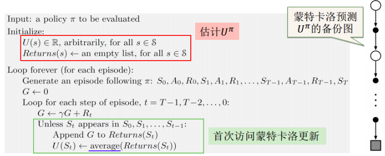
+ 算法的最后一行可采用增量估计方法, 即$U(S_t)\leftarrow U(S_t)+\alpha[G_t-U(S_t)], G_t\doteq \sum_{k=t}^T\gamma^{k-1}R_k$

#### MC Prediction, based on action-value funtion $Q$
+ 实施上, 也可使用MC方法来学习动作值函数
+ 在模型位置的强化学习问题中, 学习动作值和学习值函数往往有所区别, **动作值的学习更加重要**  
  
+ 动作值的MC Prediction算法如下  
  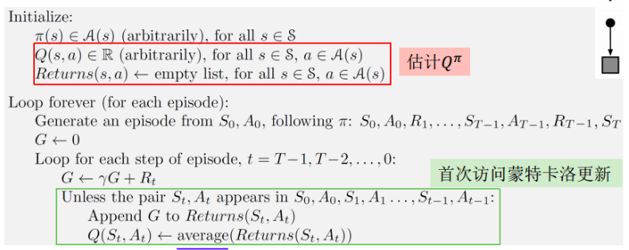

#### MC Control
+ 控制问题: 给定一个策略$\pi$, 对其进行改进
+ **方法: 在每一步选择具有最大动作值$Q(s, a)$代表的动作$a$作为新的策略**
+ **收敛条件**
  + 每个状态都要有一定的概率被访问
  + 能产生无穷多个情节的经验样本(在现实应用中只要样本数据集规模够大即可)
+ 为了保证收敛的第一个条件, 通常采用以下具体的MC算法
  + **MC Control with Exploring Starts**
    + 在control步骤, 强制使所有$(s, a)$都有可能被选中  
  
  + **MC Control without Exploring Starts**
    + 在control步骤, 使用"$\epsilon$-柔性策略$\pi$": 对任意$s \in \mathcal{S}, a\in \mathcal{A}(s) $, 均有$\pi(a|s)\geq \epsilon/|\mathcal{A}(s)| $  
    
    + **note: 这实际上是一种on-policy算法, 即使用$\epsilon$-greedy策略来进行采样和改进**

### 时序差分方法
+ 使用时序差分来更新值函数, 而不是折扣回报
+ 时序差分使用立即奖赏和后继状态的值函数来更新state-value, 因而更新步骤不必要求情节的结束. 同时, 由于后继状态的值本身也是一种对真实回报的估计, 因而TD算法是在update a guess towards a guess；MC算法则是在update a guess towards a actual return

#### Temporal Difference Prediction
+ 把增量估计用于Bellman期望方程
  $$U^\pi(s)=\sum_a \pi(a|s)\sum_{s', r}p(s', r|s, a)[r+\gamma U^\pi(s')]=\mathbb{E}_\pi[R_t+\gamma U^\pi(S_{t+1})|S_t=s] $$
  得到$U(S_t)$的更新公式
  $$U(S_t)\leftarrow U(S_t)+\alpha[R_t+\gamma U(S_{t+1})-U(S_t)]$$
  其中$\alpha$为learning rate, TD误差定义为$\delta_t\doteq R_t+\gamma U(S_{t+1})-U(S_t)$
+ 单步TD预测算法$TD(0)$  
  
+ n步TD预测算法
  + 1步TD更新的目标值为$G_{t:t+1}\doteq R_t+\gamma U(S_{t+1})$
  + 2步TD更新的目标值为$G_{t:t+2}\doteq R_t+\gamma R_{t+1}+\gamma^2 U(S_{t+2})$
  + ...
  + n布TD更新的目标值为$G_{t: t+n} \doteq R_{t}+\gamma R_{t+1}+\cdots+\gamma^{n-1} R_{t+n-1}+\gamma^{n} U\left(S_{t+n}\right)$
  + MC更新的目标值为$G_{t:T}\doteq R_t+...+\gamma^{T-t-1}R_{T-1}+\gamma^{T-t}\cdot 0$  
  

#### Sarsa: on-policy TD Control
+ 使用$(S_t, A_t, R_t, S_{t+1}, A_{t+1})$来更新Q函数
+ Sarsa算法细节: 单步Sarsa
  + 将增量估计应用于Bellman期望方程
    $$Q^\pi(s, a)=\sum_{s', r}p(s', r|s, a)[r+\gamma\sum_{a'}\pi(a', s')Q^\pi(s', a')]$$
    得到更新公式
    $$Q^\pi(S_t, A_t)\leftarrow Q(S_t, A_t)+\alpha[R_t+\gamma Q(S_{t+1}, A_{t+1})-Q(S_t, A_t)]$$
  + 使用一个适当的探索性策略, 例如$\epsilon$-greedy, Sarsa最终也能收敛到最优策略  
  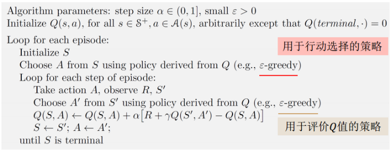
  + **Sarsa是一种on-policy算法: 用于行动选择的策略和用于Prediction的策略是相同的**
+ n步Sarsa  
  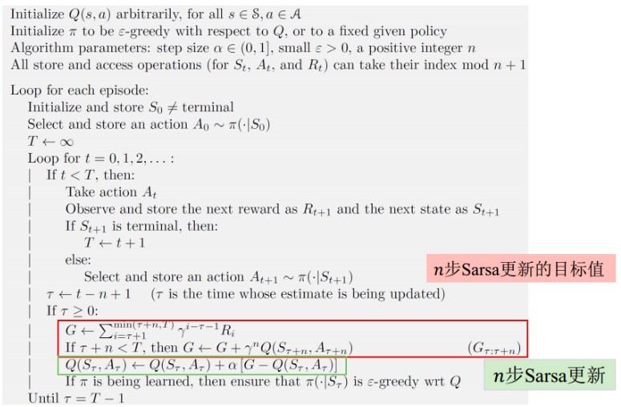

#### Q-learning: off-policy TD Control
+ 把增量估计用于行动值的Bellman最优方程
  $$Q^*(s, a)=\sum_{s', r}p(s', r|s, a)[r+\gamma \max_{a'} Q^*(s', a')]$$
  得到更新公式
  $$Q(S_t, A_t)\leftarrow Q(S_t, A_t)+\alpha[R_t+\gamma\max_a Q(S_{t+1}, a)-Q(S_t, A_t)]$$
  

> 一个小结: 可以发现, Dyna-Q算法和Q-Learning都是基于Bellman最优方程来更新Q值, 同时使用Q值导出的策略$\pi$进行下一步行动选择的; 而Sarsa使用的是Bellman期望方程, MC Control则没有时序差分的思想, **直接使用经验得到的奖赏来替换Q值**

### 资格迹与$\lambda$-算法
+ 一种让时序差分学习更加有效的机制
+ TD, Sarsa, Q-Learning在采用资格迹之后可得到TD($\lambda$), Sarsa($\lambda$), Q-Learning($\lambda$)等算法

#### 离线$\lambda$-回报算法: 目标值的组合
+ MC方法的更新目标值
  $$G_t\doteq R_t+\gamma R_{t+1}+...+\gamma^{T-t-1}R_{T-1}$$
+ n步TD的更新目标值
  $$G_{t: t+n} \doteq R_{t}+\gamma R_{t+1}+\cdots+\gamma^{n-1} R_{t+n-1}+\gamma^{n} U\left(S_{t+n}\right)$$
  $$G_{t:t+n}\doteq G_t\quad\quad \text{if  }t+n\geq T, \text{and }G_t \text{ is MC object value at timestep }t$$
+ **组合目标值**: 组合不同步TD更新的目标值作为新的目标值, 例如$\frac 12 G_{t:t+2}+\frac 12G_{t:t+4}$

#### 离线$\lambda$-回报算法: $\lambda$-回报
+ 各目标值的一种特殊加权平均组合: 定义衰减参数$\lambda\in[0, 1]$
  $$G_t^\lambda\doteq (1-\lambda)\sum_{n=1}^\infty \lambda^{n-1}G_{t:t+n}$$
  考虑到当$t+n\geq N$时, 有$G_{t:t+n}=G_t$, 可将上式拆分为
  $$G_t^\lambda = (1-\lambda)\sum_{n=1}^{T-t-1}\lambda^{n-1}G_{t:t+n}+\lambda^{T-t-1}G_t$$
  + $\lambda\rightarrow 0, G_t^\lambda\rightarrow G_{t:t+1}$
  + $\lambda\rightarrow 1, G_t^\lambda\rightarrow G_t$
  + 实际上,我们是给$t+n<T$的目标值加权$(1-\lambda)\lambda^{n-1}$, 给$t+n\geq T$的**目标值之和**整体加权$\lambda^{T-t-1}$
  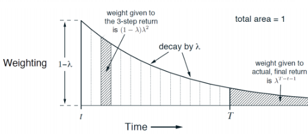

#### 离线$\lambda$-回报算法
+ 仅适用情节式任务
+ **离线**: 等到一个情节结束之后,在每个状态上计算状态值的变化,更新轨迹上所有状态的值
+ 使用$\lambda$-回报$G_t^\lambda$作为目标值进行更新
  $$U(S_t)\doteq U(S_t)+\alpha[G_t^\lambda-U(S_t)]\quad\quad \text{for  }0\leq t\leq T$$

#### 资格迹: 累积迹
+ 状态$s$处的资格迹: 状态$s$处的一个变量, 这个变量会因访问而增长, 并随时间衰减  
  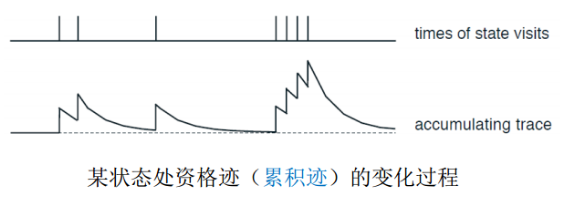
+ 累积迹的更新公式: $\gamma$为定义奖赏时使用的折扣因子, $\lambda$为累积迹的衰减因子
  $$Z_t(s)=\left\{
  \begin{aligned}
    &\gamma\lambda Z_{t-1}(s) \quad\quad\quad&\text{if }s\not = S_t \\
    &\gamma\lambda Z_{t-1}(s)+1 &\text{if }s=S_t
  \end{aligned}
  \right.$$

#### 资格迹: 替代迹
+ 替代迹的变化过程  
  
+ 替代迹的更新公式
  $$Z_t(s)=\left\{
    \begin{aligned}
      &\gamma\lambda Z_{t-1}(s) \quad\quad\quad&\text{if }s\not =S_t \\
      &1&\text{if }s=S_t
    \end{aligned}
    \right.
  $$

#### 资格迹: 荷兰迹
+ 荷兰迹的变化过程  
  
+ 荷兰迹的更新公式
  $$Z_t(s)=\left\{
    \begin{aligned}
      &\gamma\lambda Z_{t-1}(s)\quad\quad\quad &\text{if }s\not =S_t \\
      &(1-\alpha)\gamma\lambda Z_{t-1}(s)+1 &\text{if }s=S_t
    \end{aligned}
    \right.
  $$
  + $\alpha$: 学习率. $\alpha\rightarrow 0$时荷兰迹为累积迹, $\alpha\rightarrow 1$时荷兰迹为替代迹

#### TD($\lambda$)算法
+ **算法过程**
  + **计算当前状态的TD误差**: $\delta_t=R_t+U(S_{t+1})-U(S_t)$
  + **更新资格迹**
  + **更新值函数**: $U_{t+1}(s)\doteq U_t(s)+\alpha\delta_t Z_t(s)\quad\quad\text{for all }s\in \mathcal{S} $  (把当前状态经历的TD误差传播给所有状态, 并且刚刚经历过的状态受到的影响程度更大)
+ 使用累积迹的TD($\lambda$)算法  
  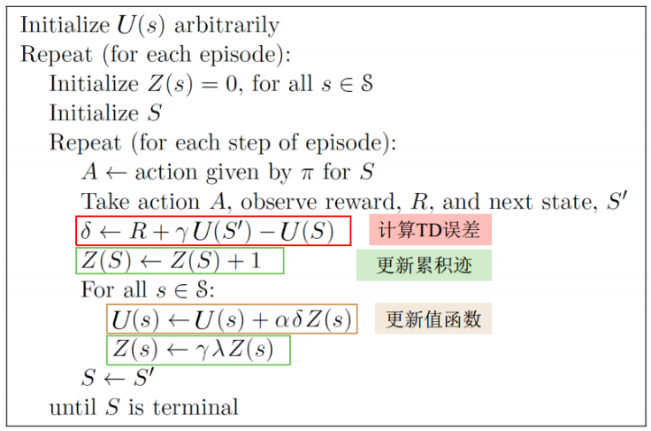
  + 这里资格迹的更新顺序和上述流程有略微不同, 主要是为了代码实现的方便
+ 一般情况下, 使用替代迹的性能要优于累积迹

#### Sarsa($\lambda$)算法
+ 下面将资格迹用于控制问题
+ **算法流程**
  + **计算当前状态的TD误差**: $\delta_t=R_t+\gamma Q_t(S_{t+1}, A_{t+1})-Q_t(S_t, A_t)$
  + **更新资格迹$Z_t$**: (以累积迹为例)
    $$Z_t(s, a)=\left\{
      \begin{aligned}
        &\gamma\lambda Z_{t-1}(s, a)+1\quad\quad &\text{if }s=S_t\text{ and }a=A_t \\
        &\gamma\lambda Z_{t-1}(s, a) &\text{otherwise.} \\
      \end{aligned}
      \right.
    $$
  + **更新行动值函数**
    $$Q_{t+1}(s, a)=Q_t(s, a)+\alpha\delta_t Z_t(s, a)$$  
  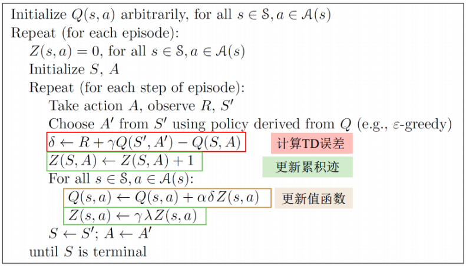

> **比较**: Sarsa vs n步Sarsa vs Sarsa($\lambda$)
> + **Sarsa**: 仅使用单步的行动奖赏更新策略, 换言之, 当前的奖赏只会影响之前一步行动值的更新
> + **n步Sarsa**: 使用之后n步的行动奖赏更新策略, 换言之, 当前的奖赏会影响到之前n步行动值的更新
> + **Sarsa($\lambda$)**: 把奖赏反向传播到之前**所有**经历的行动上, 使用累积迹来决定影响程度. 也正因此, 在Sarsa($\lambda$)算法中只需要使用一步TD误差来更新
> + **由此可见, Sarsa($\lambda$)是一种 back propagation 的思想**  
> 

#### Q($\lambda$)算法
+ 与Sarsa($\lambda$)不同, **每次"向前看"的过程最多到第一个非贪心行动处就会终止**. 从"向后看"的视角来看, 对当前状态行动值的更新只会用到向后一直到第一个非贪心行动之前的行动的奖赏.
  + 即, 如果$A_{t+n}$是第一个非贪心行动, 则最长TD更新的目标值为: $R_t+\gamma R_{t+1}+...+\gamma^{n-1} R_{t+n-1}+\gamma^n\max_a Q_t(S_{t+n}, a)$  (这里没有考虑考虑$\lambda$)  
  

+ **算法过程**
  + **计算当前状态的TD误差$\delta_t$**: $\delta_t = R_{t}+\gamma\max_{a'}Q_t(S_{t+1}, a')-Q_t(S_t, A_t)$
  + **更新资格迹$Z_t$**
  $$Z_t(s, a)=\mathbb{I}(s=S_t)\cdot \mathbb{I}(a=A_t)+\left\{
    \begin{aligned}
      &\gamma\lambda Z_{t-1}(s, a)\quad &\text{if }Q_{t-1}(S_t, A_t)=\max_a Q_{t-1}(S_t, a) \\
      &0 &\text{otherwise} \\
    \end{aligned}
    \right.
  $$
    + 简单证明即可发现上式满足"向前看知道第一个非贪心状态"的要求
  + **更新行动值函数**
  $$Q_{t+1}(s, a)=Q_t(s, a)+\alpha\delta_t Z_t(s, a)\quad\quad \forall s\in \mathcal{S}, a\in \mathcal{A} $$
  + 伪代码如下  
  

---

## 泛化
+ 在上述强化学习算法中, 我们并未对问题的具体形式作出讨论. 譬如, 我们使用$Q(s, a)$表示状态$s$行动$a$的动作值, 但是在具体的代码实现或问题描述中, 我们怎样去表征$Q(s, a)$呢? 
  最简单的方式是使用表格来存储. 但是表格仅适用于较小的状态空间, 当处理规模无限和连续的状态空间时, 为了将**有限的经验推广到无限的状态上**, 让Agent根据经验对在未知状态下作出合理的决策, 我们需要引入**泛化**方法. 
+ 某种程度上, 泛化有些许类似近似推理. 近似推理通过有限状态集合的值来建模近似整个空间的状态的值, 而泛化的核心也在于此. 

### 半梯度预测和控制

+ 预测问题的目标函数
  + 假设我们**使用$ \mathbf{w} $来参数化近似的值函数表示**, 令$\mu(s)$为给定策略$\pi$时状态$s$的稳态分布, $v_\pi(s)$为策略$\pi$的真实的值函数, $\hat{v}(s, \mathbf{w})$为对$v_\pi$的近似值函数, 则目标为最小化均方误差
  $$\overline{\mathrm{VE}}(\mathbf{w}) \doteq \sum_{s \in \mathcal{S}} \mu(s)\left[v_{\pi}(s)-\hat{v}(s, \mathbf{w})\right]^{2}$$
+ **那么预测问题实际上就变成了最小化均方误差问题, 控制问题也相应发生变化. 因此在下面的讨论中, 可以通过优化$ \mathbf{w} $的方式使估计逼近真实动作值从而完成预测, 然后通过control方法改善策略. 和之前的讨论类似, 算法目标从计算$Q$变为计算$ \mathbf{w} $.**
+ 随机梯度下降
  $$ \mathbf{w}_{t+1}\doteq \mathbf{w}_t-\frac 12\alpha\nabla \left[v_{\pi}(s)-\hat{v}(s, \mathbf{w})\right]^{2}= \mathbf{w}_t +\alpha[v_{\pi}(S_t)-\hat{v}(S_t, \mathbf{w}_t)]\nabla \hat{v}(S_t, \mathbf{w}_t) $$
  + 当$v_\pi (S_t)$未知时, 可使用一个对$v_\pi(s)$的无偏估计$U_t$来替代
    + **Gradient Monte Carlo Algorithm**: 使用蒙特卡洛方法, 采样一条到情节结束的episode并使用$G_t$作为$U_t$  
      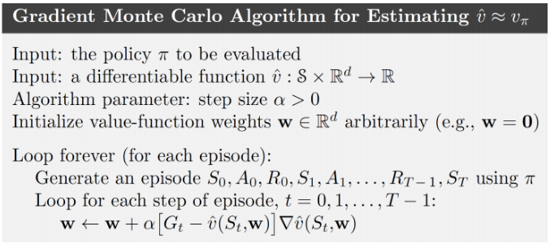
    + **Semi Gradient Descendent TD(0)**: 使用1步TD更新的目标值作为$U_t$, 即$U_t\doteq R_{t+1}+\gamma \hat{v}(S_{t+1}, \mathbf{w}) $  
      此时有
      $$ 
      \begin{aligned}
        \mathbf{w}_{t+1}&=\mathbf{w}_t-\frac 12\alpha\nabla[R_t+\gamma \hat{v}(S_{t+1}, \mathbf{w}_t)-\hat{v}(S_t, \mathbf{w}_t)]^2 \\
        &= \mathbf{w}_t+\alpha[R_t+\gamma \hat{v}(S_{t+1}. \mathbf{w}_t)]\nabla \hat{v}(S_t, \mathbf{w}_t)-\alpha\gamma[R_t+\gamma \hat{v}(S_{t+1}. \mathbf{w}_t)]\nabla \hat{v}(S_{t+1}, \mathbf{w}_t) \\
      \end{aligned}
      $$
      在半梯度下降方法下, 默认上式第三项为0. 算法如下:  
      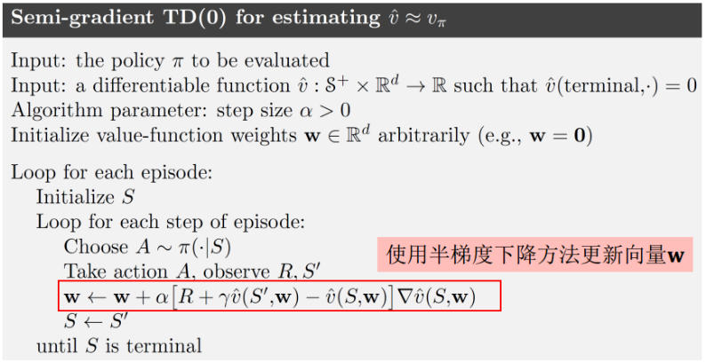
    + **n-step Semi Gradient Descent**: 使用n步TD更新的目标值作为$U_t$. 同理, 这里的半梯度更新体现在忽略后续状态的近似值对$ \mathbf{w}_t $的导数.   
    
    + **Semi Gradient Descent TD($\lambda$)**: 使用累积迹的半梯度TD($\lambda$)算法  
    
    + **Semi Gradient Descent Sarsa** :由于在到达终止状态后不存在下一个状态$S_{t+1}$, 因此作了一点额外的讨论. 基本的思想同上.   
    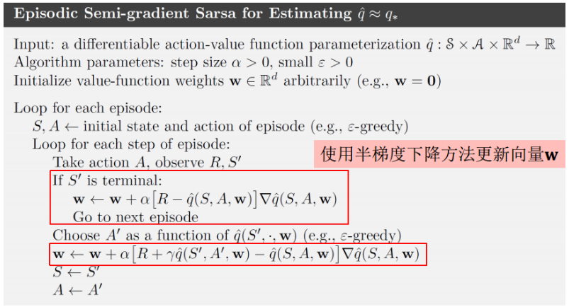
    + **n步半梯度Sarsa**: 算法如下  
    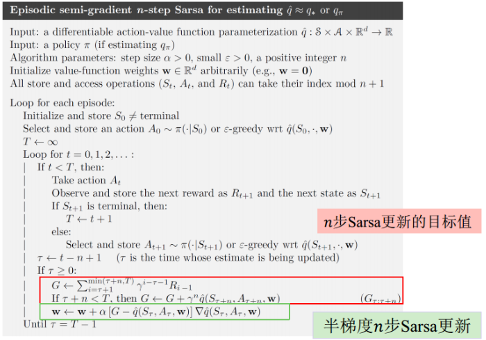
    + **结合二值特征和线性函数近似的Sarsa($\lambda$)**
      + 当状态变量为二值特征, 每一个特征 i 都有其权重$\omega_i$, 使用一个函数$ \mathcal{F}(s, a) $, 接收一对状态-行动对, 输出被激活的状态变量. 比如如果对于$(s, a)$, $ \mathcal{F} $返回$\{1, 2, 3\}$, 表明$Q(s, a)=\omega_1+\omega_2+\omega_3$
      + 在上述$Q$的定义下, $Q$关于各个状态变量$\omega_i$的导数也相应发生变化, 具体变化请见下面的算法  

      

### 近似和抽象
+ 在半梯度预测和控制方法中我们忽略了一个问题, 怎样使用$ \mathbf{w} $来参数化动作值函数$Q$ ?

#### 局部近似方法
+ **[Hypothesis]**: 相互接近的状态有相似的行动值
##### 线性近似: 符号表示
+ 给出一个有限状态集合$ \mathcal{S} $和有限行动集合$ \mathcal{A} $, 对所有$ s\in \mathcal{S}, a\in \mathcal{A} $存储$Q(s, a)$, 记为$\theta_{s, a}$. 所有的$\theta_{s,a}$构成形状为$|\mathcal{S}|\times |\mathcal{A}|$的参数矩阵$ \mathbf{\Theta} $. 记$ \mathcal{S} $中的状态为"支撑状态"
+ 使用$ \theta $近似任意状态$s$的行动值: 
$$Q(s, a)=\sum_{s'}\theta_{s', a}\beta(s, s')$$
  + 其中, $\beta(s, s')$被称为核, 满足$\sum_{s'}\beta(s, s')=1$

##### 线性近似: 核
+ 定义$ \boldsymbol{\beta}(s)=(\beta(s, s_1), ..., \beta(s, s_{|\mathcal{S}|}))^\top $为核的向量版本, 为长度为$|\mathcal{S}|$的向量
+ 定义$ \mathbf{B} $为一个形状为$|\mathcal{S}|\times|\mathcal{A}|$的参数矩阵, 其中的每一列都代表在各个$s\in \mathcal{S} $处采取某个行动$a$时的核向量(记为$\beta(\cdot, a)$), 它们均等于$ \boldsymbol{\beta}(s) $. 换言之, $ \mathbf{B} $是$ \boldsymbol{\beta}(s) $在$a$上的扩展
(上面这一长段是教科书上的内容, 但是这定义实在生涩难懂, 因此在下面的论述中我改写了形式)
+ 于是有
  $$Q(s, a)=\theta_{\cdot, a}^\top \boldsymbol{\beta}(s) $$
  $$ \mathbf{Q}(s)=\mathbf{\Theta}^\top \boldsymbol{\beta}(s)=(Q(s, a_1), Q(s, a_2), ..., Q(s, a_{\mathcal{A}})) $$
+ 在Q-Learning下, 用$\theta$参数化的动作值估计的更新公式便为
  $$ \mathbf{\Theta}\leftarrow \mathbf{\Theta}+\alpha(R_t+\gamma\max_{A_{t+1}} Q(S_{t+1}, A_{t+1})-Q(S_t, A_t))\boldsymbol{\beta}(s)\quad\text{the update is restricted on column }\mathbf{\Theta}(\cdot, A_t) $$
  + 从直觉上看, 更新公式会给距离待近似状态更近的支撑状态的值以更大的更新

##### 线性近似Q-Learning方法
+ 将下图中的红框公式替换为
  $$ \mathbf{\Theta}\leftarrow \mathbf{\Theta}+\alpha(R_t+\gamma\max_{A_{t+1}} Q(S_{t+1}, A_{t+1})-Q(S_t, A_t))\boldsymbol{\beta}(s)\quad\text{the update is restricted on column }\mathbf{\Theta}(\cdot, A_t) $$

+ **可能的算法改进**
  + 动态调整支撑状态的点的位置
  + **当某个状态距离所有支撑状态的距离大于某一个阈值时, 可将它添加到支撑状态集合中**

#### 全局近似方法
+ 同近似推理算法一样, 不依赖于某种距离的度量/定义

##### 感知机Q-Learning方法
+ 感知机
  + 一个输入节点的集合$\beta_{1:m}$
  + 一个权重的集合$\theta_{1:m}$
  + 一个输出节点$q$,其中$q=\sum\limits_{i=1}^m\theta_i \beta_i=\theta^\top \boldsymbol{\beta} $  
  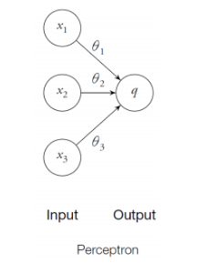
+ 为每一个可能的行动$a$建立一个感知机, 共$n$个
+ 设这感知机的输入$ \boldsymbol{\beta}(s)=( \beta _1(s), \beta _2(s), ...,\beta _m(s))$
  + $ \boldsymbol{\beta}_{1:m} $是定义在状态空间上的一组基函数, 每一个$ \boldsymbol{\beta}(s) $均为长度为$m$的向量
+ 设$\theta_a$是与行动$a$的感知机对应的$m$个权重, 则
  $$Q(s, a)=\theta_a^\top\boldsymbol{\beta}(s)$$
  基于这个表示, 我们可以得到和线性近似Q-Learning相仿的算法, 更新时只需要对某一特定的感知机的$\theta_a$进行更新即可

##### 神经网络方法
+ 使用定义在状态空间上的基函数$\beta_{1:m}$处理后得到的$\beta_{1:m}(s)$作为输入
+ 输出设置为动作值函数
+ 使用back-propagation进行权重调整和训练
+ (+): 能应用到非线性情况中, 不需要精心设计输入层的基函数, 而能够自动学习特征
+ (-): 不一定收敛

##### 抽象方法
+ 将状态空间分割成离散的区域, 估计每个区域的行动值
  + 通常使用决策树来分割状态空间
  + 树的内部节点是对状态空间不同维度的测试
  + 叶子节点对应区域
+ 通常应用于**model-based learning**
+ 代表性算法
  + 从单一区域(aka只有一个节点的决策树)开始, 然后应用一系列**行动, 建模和规划**步骤
  + **行动阶段**
    + 在状态$s$采取行动$a$, 观察到转移至的状态$s'$并得到奖赏$r$后, 把经验元组$(s, a, s', r)$存储在与$s$相关联的叶子节点中
  + **建模阶段**: 决定是否分割节点
    + 对所有叶子节点中的每个经验元组, 计算$q(s, a)=r+\gamma U(s')$
    + 当经验元组的值来自不同分布时, 分割一个叶子节点
      + 一种分割方法: 最小化所导致的叶子节点的经验元组的方差
      + 当满足某一终止条件(如叶子节点的方差低于某阈值)时, 停止分割
  + **规划阶段**
    + 使用在叶子节点的经验元组来估计状态转移模型和奖赏模型
    + 用DP来求解得到的MDP

### Deep Q-Network
+ **Experience Replay**: 使用之前所有经验的一个minibatch来进行训练
+ **off-policy**: 两个同结构的网络: 动作值网络$Q$和目标网络$\hat{Q}$
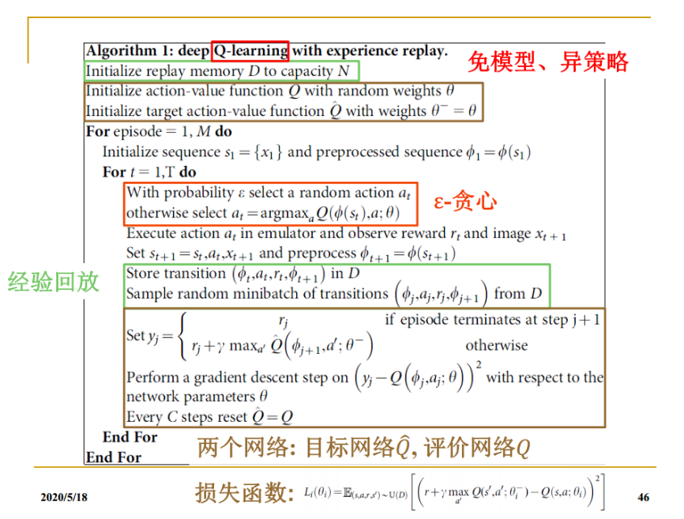

---
## 基于策略
+ 基于值函数 or 基于策略?
  + 基于策略的方法直接学习一个参数化的策略, 而不需要值函数来导出行动策略
+ 优势
  + 从行动偏好导出的最优策略的估计**不拘泥于特定的形式**, 能自然而然地逼近确定性策略, 无需手动调参
    + 而由行动值函数导出的最优策略估计往往是有特定形式的, 比如$\epsilon$-贪心策略
  + 能自然找到最优的随机策略
  + 在一些问题中, 与值函数相比策略函数更简单且更易于表达, 基于策略的方法能更快学到近似最优策略
  + 更容易表达对问题的先验知识
+ 基于策略需要讨论两个问题
  + 如何表示策略 -> 策略近似
  + 如何优化策略 -> 策略梯度方法

### 策略近似

#### 策略近似: 离散行动空间
+ 符号表示
  + $ \boldsymbol{\theta} \in \mathbb{R}^{d'} $: 策略参数向量
  + $ \pi(a|s, \boldsymbol{\theta}) $: 给定参数$ \boldsymbol{\theta} $, 在$t$时刻, 在状态$s$采取行动$a$的概率
  + 假设$\pi(a|s, \boldsymbol{\theta})$关于$ \boldsymbol{\theta} $可微分
  + 假设策略是非确定性的以保证探索
    $$\pi(a|s, \boldsymbol{\theta})\in(0, 1)\quad\quad \text{for all }s, a, \boldsymbol{\theta} $$
  + 定义一个参数化的行动偏好函数: $h(s, a, \boldsymbol{\theta})\in \mathbb{R} $
    + 形式不限, 可以为神经网络, 也可以为线性函数$h(s, a, \boldsymbol{\theta})=\boldsymbol{\theta}^\top \boldsymbol{x}(s, a) $
  + 最后, 使用softmax定义策略
  $$\pi(a|s, \boldsymbol{\theta})\doteq\frac{e^{h(s, a, \boldsymbol{\theta})}}{\sum_b e^{h(s, b, \boldsymbol{\theta})}}$$

#### 策略近似: 连续行动空间

+ 符号表示
  + 相应的, 使用某种概率分布的统计量来参数化策略, 最好是用神经网络, 在下面的过程中我们使用高斯分布
  + 假设$\pi(a|s, \boldsymbol{\theta})$服从高斯分布
    $$\pi(a | s, \boldsymbol{\theta}) \doteq \frac{1}{\sigma(s, \boldsymbol{\theta}) \sqrt{2 \pi}} \exp \left(-\frac{(a-\mu(s, \boldsymbol{\theta}))^{2}}{2 \sigma(s, \boldsymbol{\theta})^{2}}\right)$$
    + $\mu: \mathcal{S}\times \mathbb{R}^{d'}\rightarrow \mathbb{R} $
    + $\sigma: \mathcal{S}\times \mathbb{R}^{d'}\rightarrow \mathbb{R}^+ $
  + 则参数向量$ \boldsymbol{\theta}=[\boldsymbol{\theta}_\mu, \boldsymbol{\theta}_\sigma]^\top $被用于定义
    + $\mu(s, \boldsymbol{\theta})\doteq \boldsymbol{\theta}_\mu^\top \boldsymbol{x}_\mu(s) $
    + $\sigma(s, \boldsymbol{\theta})\doteq \exp(\boldsymbol{\theta}_\sigma^\top \boldsymbol{x}_\sigma(s))$

> 例子: 参数化策略表示下的短走廊问题  
>   
> 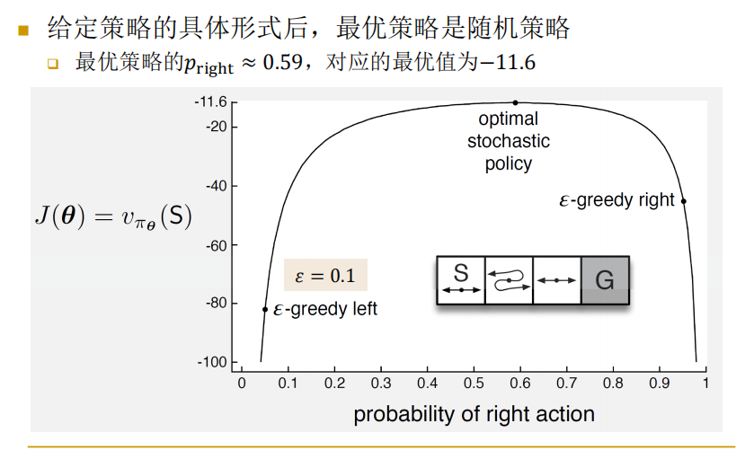  
> 在这个例子中可以发现, 策略近似可以逼近最优策略, 而$\epsilon$-贪心策略均无法很好地逼近

### 策略梯度方法
+ 目标: 最大化性能度量$J(\boldsymbol{\theta})$
+ 方法: 基于$J(\boldsymbol{\theta})$的梯度来学习$ \boldsymbol{\theta} $, 使用随机梯度上升法, 设$\widehat{\nabla J(\boldsymbol{\theta}_j)}$为$\nabla J(\boldsymbol{\theta})$的随机估计, 则
  $$ \boldsymbol{\theta}_{t+1}=\boldsymbol{\theta}_t+\alpha\widehat{\nabla J(\boldsymbol{\theta}_t)} $$
  + **情节式任务**: 定义性能度量为初始状态的值
  $$J(\boldsymbol{\theta})\doteq v_{\pi_{\boldsymbol{\theta}}}(s_0)$$
  此时有**策略梯度定理**
  $$
  \begin{aligned}
  \nabla J(\boldsymbol{\theta}) &\propto \sum_{s} \mu(s) \sum_{a} q_{\pi}(s, a) \nabla \pi(a | s, \boldsymbol{\theta})&(\gamma=1)\\
  & =\mathbb{E}_\pi [\sum_a q_\pi(S_t, a)\nabla_\pi(a|S_t, \boldsymbol{\theta})] \\
  \end{aligned}
  $$
  + **连续式任务**: 定义性能度量为为每一时间步的平均奖赏
  $$
  \begin{aligned}
    J(\boldsymbol{\theta})\doteq r(\pi)&\doteq \lim_{h\to\infty}\frac 1h\sum_{t=1}^h \mathbb{E}[R_{t-1}|S_0, A_{0:t-1}\sim\pi] \\
    &=\lim_{t\to\infty} \mathbb{E}[R_{t-1}|S_0, A_{0:t-1}\sim\pi] \\
    &=\sum_s\mu(s)\sum_a\pi(a|s)\sum_{s', r}p(s', r|s, a)r
  \end{aligned}
  $$
  进一步定义差分回报
  $$G_t\doteq R_{t+1}-r(\pi)+R_{t+2}-r(\pi)+...$$
  $$v_\pi(s)\doteq \mathbb{E}_\pi[G_t|S_t=s]\quad\quad q_\pi(s, a)\doteq \mathbb{E}_\pi[G_t|S_t=s, A_t=a] $$
  此时有**策略梯度定理**
  $$\nabla J(\boldsymbol{\theta})=\sum_s \mu(s)\sum_a \nabla\pi(a|s)q_\pi(s, a)$$

  + 此处$\mu(s)$为给定策略$\pi$后状态$s$的稳态分布, 满足
  $$\sum_s\mu(s)\sum_a\pi(a|s, \boldsymbol{\theta})p(s'|s, a)=\mu(s')\quad\quad \text{for all }s'\in \mathcal{S} $$
#### 基于所有行动的策略更新方法
+ 在情节式任务下, 将$\nabla J(\boldsymbol{\theta})$作为估计代入策略梯度定理, 有更新公式
  $$ \boldsymbol{\theta}_{t+1}\doteq \boldsymbol{\theta}_t+\alpha\sum_a \hat{q}(S_t, a, \boldsymbol{w})\nabla\pi(a|S_t, \boldsymbol{\theta}) $$
  注意此处$ \hat{q} $为真实$q$值的估计, 并且会被参数向量$ \boldsymbol{w} $所参数化
+ 此处的更新公式需要遍历所有可能的动作$a$

#### 基于部分行动的策略更新方法: REINFORCE
+ 以情节式任务为例
+ REward Increment = Nonnegative Factor, Offset Reinforcement, Characteristic Eligibility
+ 在策略梯度定理中, 使用采样样本$A_t\sim \pi$来代替$a$的期望
  $$
  \begin{aligned}
    \nabla J(\boldsymbol{\theta}) &\propto \mathbb{E}_{\pi}\left[\sum_{a} q_{\pi}\left(S_{t}, a\right) \nabla \pi\left(a | S_{t}, \boldsymbol{\theta}\right)\right] \\
    &= \mathbb{E}_\pi\left[\sum_a\pi(a|S_t, \boldsymbol{\theta})q_\pi(S_t, a)\frac{\nabla\pi(a|S_t, \boldsymbol{\theta})}{\pi(a|S_t, \boldsymbol{\theta})}\right] \\
    &=\mathbb{E}_\pi\left[\mathbb{E}_a\left[q_\pi(S_t, a)\frac{\nabla\pi(a|S_t, \boldsymbol{\theta})}{\pi(a|S_t, \boldsymbol{\theta})}\right]\right] \\
    &=\mathbb{E}_\pi\left[q_\pi(S_t, A_t)\frac{\nabla\pi(A_t|S_t, \boldsymbol{\theta})}{\pi(A_t|S_t, \boldsymbol{\theta})}\right] &(\text{用样本替代期望}) \\
    &=\mathbb{E}_\pi\left[G_t\frac{\nabla\pi(A_t|S_t, \boldsymbol{\theta})}{\pi(A_t|S_t, \boldsymbol{\theta})}\right] &(\mathbb{E}_\pi\left[G_t|S_t, A_t\right]=q_\pi(S_t, A_t))
  \end{aligned}
  $$
+ 策略参数向量$\theta$的参数更新公式
  $$\boldsymbol{\theta}_{t+1} \doteq \boldsymbol{\theta}_{t}+\alpha G_{t} \frac{\nabla \pi\left(A_{t} | S_{t}, \boldsymbol{\theta}_{t}\right)}{\pi\left(A_{t} | S_{t}, \boldsymbol{\theta}_{t}\right)}$$
+ REINFORCE实际上是一种基于蒙特卡洛的策略梯度控制算法, 伪代码如下  
  
  + Nonnegative Factor: $\gamma^t$
  + Offset Reinforcement $G$
  + Characteristic Eligibility $\nabla\ln \pi(A_t|S_t, \boldsymbol{\theta}_t)$
    + 由策略近似这一部分, 我们可以写出资格向量的具体形式
    + 假设策略服从softmax分布$\pi(a | s, \boldsymbol{\theta}) \doteq \frac{e^{h(s, a, \boldsymbol{\theta})}}{\sum_{b} e^{h(s, b, \boldsymbol{\theta})}}$, 其中行动偏好函数为$h(s, a, \boldsymbol{\theta})=\boldsymbol{\theta}^\top \boldsymbol{x}(s, a) $
    + 则资格向量的具体形式为
      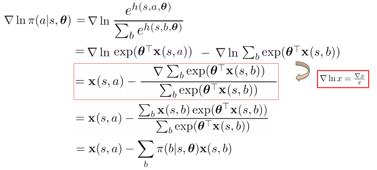

##### 使用基线的REINFORCE算法
+ **基线函数**: 假设有一个不随$a$变化的任意基线函数$b(s)$满足
  $$\sum_a b(s)\nabla\pi(a|s, \boldsymbol{\theta})=b(s)\nabla\sum_a\pi(a|s, \boldsymbol{\theta})=b(s)\nabla 1=0$$
+ 对应的策略梯度定理
  $$\nabla J(\boldsymbol{\theta})\propto \sum_s \mu(s)\sum_a\left(q_\pi(s, a)-b(s)\right)\nabla\pi(a|s, \boldsymbol{\theta})$$
+ **使用基线的REINFORCE的更新公式**
  $$\boldsymbol{\theta}_{t+1} \doteq \boldsymbol{\theta}_{t}+\alpha (G_{t} -b(S_t))\frac{\nabla \pi\left(A_{t} | S_{t}, \boldsymbol{\theta}_{t}\right)}{\pi\left(A_{t} | S_{t}, \boldsymbol{\theta}_{t}\right)}$$
+ **使用基线的REINFORCE算法的伪代码**  
  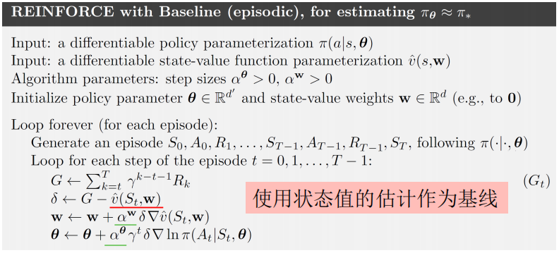
  + 可以看到, 在使用基线的REINFORCE算法中还同时对状态值进行了近似表示和参数化估计
  + 其中设置了两个学习率参数
    + $\alpha^\boldsymbol{w} $: 用于学习值函数
    + $\alpha^ \boldsymbol{\theta} $: 用于学习策略
+ **使用基线的REINFORCE算法能更快速地学习到最优策略**

#### 基于部分行动的策略更新方法: 行动者-评论家
+ 以情节式任务为例
+ **行动者-评论家**: 进一步引入bootstrapping思想, 减小方差, 加速学习. 
  + 在使用基线的REINFORCE算法中, 我们实际上是用的是MC误差$G_t-b(S_t)=G_t-\hat{v}(S_t, \boldsymbol{w}) $
  + 而在行动者-评论家方法中, 使用TD误差. 以一步TD误差为例, 更新公式为
  $$
  \begin{aligned}
    \boldsymbol{\theta}_{t+1} &\doteq \boldsymbol{\theta}_{t}+\alpha \left(G_{t:t+1}-\hat{v}(S_t, \boldsymbol{w})\right)\frac{\nabla \pi\left(A_{t} | S_{t}, \boldsymbol{\theta}_{t}\right)}{\pi\left(A_{t} | S_{t}, \boldsymbol{\theta}_{t}\right)} \\
    &=\boldsymbol{\theta}_t+\alpha(R_t+\gamma \hat{v}(S_{t+1}, \boldsymbol{w})-\hat{v}(S_t, \boldsymbol{w}))\frac{\nabla \pi\left(A_{t} | S_{t}, \boldsymbol{\theta}_{t}\right)}{\pi\left(A_{t} | S_{t}, \boldsymbol{\theta}_{t}\right)} \\
    &=\boldsymbol{\theta}_t+\alpha\delta_t \frac{\nabla \pi\left(A_{t} | S_{t}, \boldsymbol{\theta}_{t}\right)}{\pi\left(A_{t} | S_{t}, \boldsymbol{\theta}_{t}\right)}
  \end{aligned}
  $$
+ 伪代码
  + 一步行动者-评论家控制算法  
  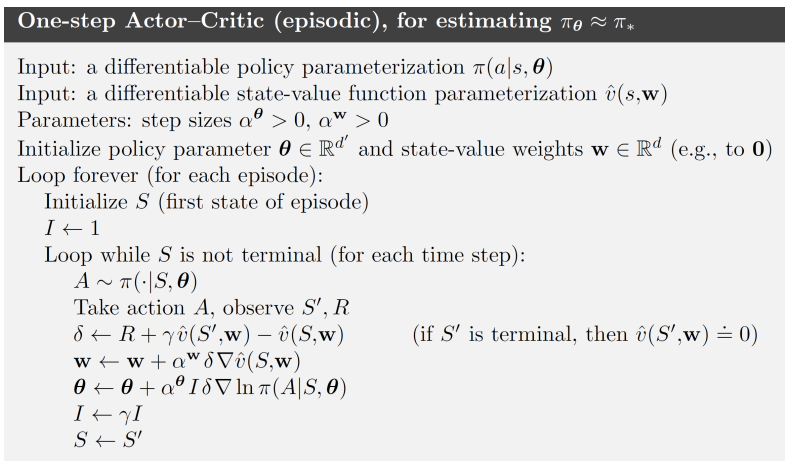
  + 使用资格迹的行动者-评论家算法  
  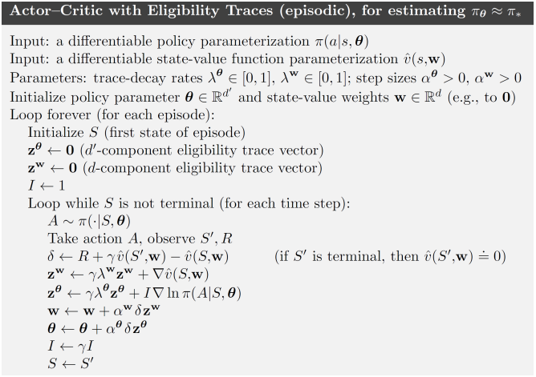
  + 连续式任务下, 使用资格迹的行动者-评论家算法  
  
+ **行动者-评论家**算法的架构如下  
  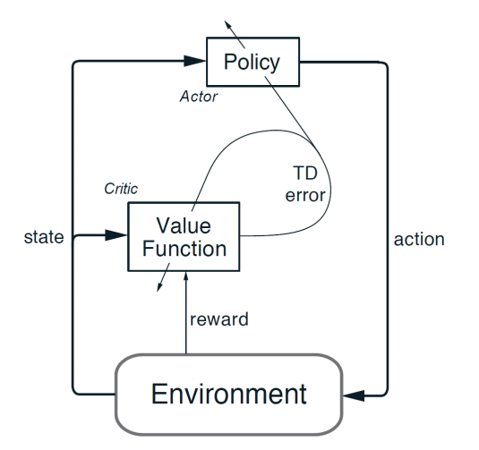
  + **在行动者-评论家架构中, 有两个相互并行的架构: 值函数和策略, 分别代表着评论家和行动者. 在计算的到TD误差时, 会同时用于更新这两个架构/函数. 在之前学习的很多方法都是critic-only或者actor-only的. 比如REINFORCE算法, 没有值函数的设计, 因此是actor-only；而Q-learning和Sarsa等算法由于策略都是由值函数直接导出的, 没有单独的策略结构, 因而都是critic-only.**

---
## 更多拓展算法...
+ 使策略单调提升的优化算法
  + TRPO: 通过置信域约束来设置合适的学习率
  + PPO: 把惩罚设计进目标函数, 优化目标更加简洁
+ 优势行动者-评论家算法
  + A3C
  + A2C
+ 基于确定性策略梯度的算法
  + DPG, DDPG, TD3, D4PG, MADDPG...