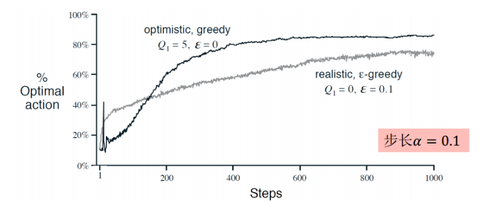
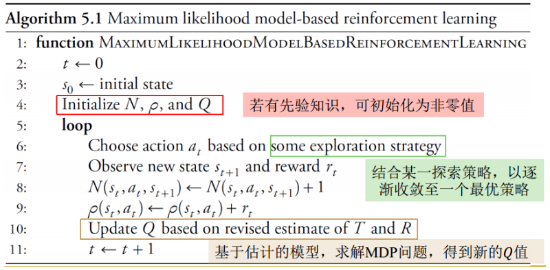
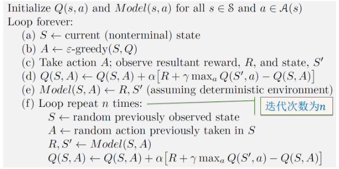
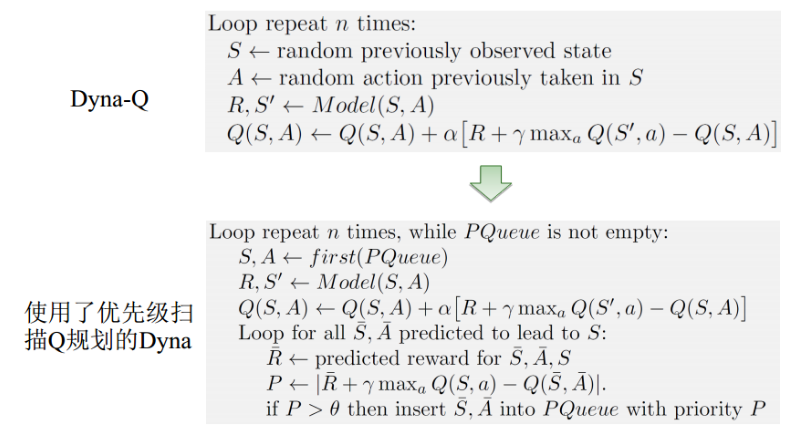
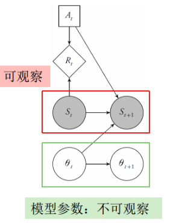
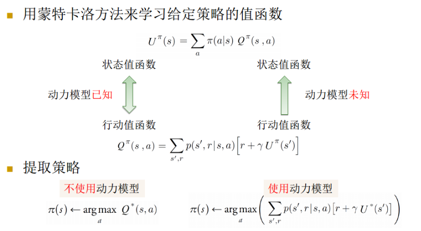

# 强化学习
+ 状态转移模型、奖赏模型未知
+ 智能体需要从经验中学习
+ 面对三方面挑战
  + 探索与利用（Exploraion and Exploitation）
  + 信度分配（Credit Assignmnet）
    + 奖赏具有延迟性，需要把奖赏的信度分配给早些作出的、具有重要作用的决策
  + 泛化（Generalization）

---
## 探索与利用

### n-摇臂赌博机
+ 问题描述
  + 有n个摇臂，赌徒在投入一个硬币后可选择拉下其中一个摇臂
  + 每个摇臂 $i$ 以一定概率 $\theta_i$ 吐出硬币，但概率未知
  + 总共能拉h次摇臂
  + **目标**：通过一定策略最大化自己的奖赏
+ 问题分析
  + 在n0摇臂赌博机模型中，探索体现在估计摇臂的优劣，利用体现在选择当前自认为最好的摇臂

### 利用
+ 在已有一定探索经验的前提下，利用探索经验作出决策（即评估各摇臂好坏）

#### n-摇臂赌博机：极大似然估计
+ 设在摇臂$i$上获胜的次数为$w_i$，失败的次数为$l_i$，则由极大似然估计，将认定$\theta_i=\frac{w_i}{w_i+l_i}$

#### n-摇臂赌博机：贝叶斯模型估计
+ 使用均匀分布$ \mathrm{Beta}(1,1) $作为$\theta_i$的先验分布
+ 对摇臂$i$，记录获胜次数$w_i$和失败次数$l_i$，则$\theta_i$的后验分布为$ \mathrm{Beta}(w_i +1, l_i+1) $
+ 由后验分布可进一步推知摇臂$i$上获胜的后验概率为
  $$\rho_{i}=P\left(\operatorname{win}_{i} | w_{i}, \ell_{i}\right)=\int_{0}^{1} \theta_{i} \times \operatorname{Beta}\left(\theta_{i} | w_{i}+1, \ell_{i}+1\right) d \theta_{i}=\frac{w_{i}+1}{w_{i}+\ell_{i}+2}$$

> 例子
> 

### 探索
+ **无向的探索策略**：不使用之前的行动结果信息来指导非贪心行动的选择
+ **有向的探索策略**：使用之前的行动结果信息来指导非贪心行动的选择

#### 贪心（无探索策略）
+ **真实行动值**：在$t$时刻选择行动$a$的期望奖赏
  $$q^*(a)\doteq \mathbb{E}[R_t|A_t=a] $$
+ **行动值**：在$t$时刻之前，选择行动$a$的平均奖赏
  $$Q_t(a)=\frac{\sum_{i=1}^{t-1}R_i\cdot \mathbb{I}(A_i=a)}{\sum_{i=1}^{t-1} \mathbb{I}(A_i=a)}$$
  + 使用行动值作为对真实行动值的估计
+ **贪心**：在$t$时刻，选择使行动值$Q_t(a)$最大的行动
  $$A_t\doteq \argmax_a Q_t(a)$$

#### 无向的探索策略

##### $\epsilon$贪心
+ 基于概率值$\epsilon$来对探索和利用进行折中
+ 以$\epsilon$的概率随机选择一个摇臂，以$1-\epsilon$的概率选择摇臂$\argmax_i Q_t(i)$

##### 乐观初始化
+ 给所有初始行动值估计$Q_1(a)$一个乐观值（较大的值），鼓励对未探索过的或者探索次数比较少的行动进行探索

#### 有向的探索策略

##### 上置信界探索（UCB）
+ 区间探索：计算$q^*(a)$的$\alpha \%$置信区间，选择上置信界最大的摇臂
  + $\alpha$越大，探索程度越高
+ 上置信界（UCB）行动选择
  $$A_{t} \doteq \underset{a}{\operatorname{argmax}}\left[Q_{t}(a)+c \sqrt{\frac{\ln t}{N_{t}(a)}}\right]$$

##### 随机梯度上升
+ $H_t(a)$：对行动$a$的偏好程度
+ 根据软最大化分布选择行动
  $$\operatorname{Pr}\left\{A_{t}=a\right\} \doteq \frac{e^{H_{t}(a)}}{\sum_{b=1}^{k} e^{H_{t}(b)}} \doteq \pi_{t}(a)$$
+ 在每一步采取行动$A_t$得到奖赏$R_t$后，更新偏好
  $$H_{t+1}\left(A_{t}\right) \doteq H_{t}\left(A_{t}\right)+\alpha\left(R_{t}-\bar{R}_{t}\right)\left(1-\pi_{t}\left(A_{t}\right)\right)$$
  $$H_{t+1}(a)\doteq H_t(a)-\alpha(R_t-\bar{R}_t)\pi_t(a), \quad \text{for all }a\not =A_t$$
  + 其中，$\bar{R}_t$是一个人为规定的基准项

### 最优探索策略
+ 信念状态
  + 计数$w_1, l_1, ..., w_n, l_n$分别所有摇臂的获胜次数、失败次数
  + 用作一个表示n-摇臂赌博机问题的MDP状态
+ 动态规划
  + 使用动态规划确定最优策略$\pi^*$，输入为$w_{1:n}, l_{1:n}$，输出为作出的决策摇臂$i$
  + 定义$Q^*(w_{1:n}, l_{1:n}, i)$为拉摇臂$i$，然后执行最优行动得到的期望回报
  + 则最优状态值函数$U^*(w_{1:n}, l_{1:n})$和最优策略$\pi^*(w_{1:n}, l_{1:n})$为
  $$U^*(w_{1:n}, l_{1:n})=\max_i Q^*(w_{1:n}, l_{1:n}, i)$$
  $$\pi^*(w_{1:n}, l_{1:n})=\argmax_i Q^*(w_{1:n}, l_{1:n}, i)$$
  + 有$Q^*$的迭代式
  $$Q^*(w_{1:n}, l_{1:n}, i)=\frac{w_i+1}{w_i+l_i+2}(1+U^*(..., w_i+1, l_i, ...))+\frac{l_i+1}{w_i+l_i+2}U^*(...,w_i, l_i+1,...)$$
    在有限步数$\sum_i(w_i+l_i)=h$时，有$U^*(w_{1:n}, l_{1:n})=0$  
    然后可计算出所有$\sum_{i}(w_i+l_i)=h-1$的信念状态的$U^*$  
    ...  
    依次进行，直到计算完$\sum_{i}(w_i+l_i)=0$的信念状态的$U^*$  
    总的时空复杂度为$O(\frac{2^hn^h}{h!})$

---
## 基于模型的强化学习方法
+ 模型和规划
  + 模型: 可以用于预测环境如何对Agent的行动作出响应(给出奖赏, etc)
    + **具体到本章节所讲的问题中, 模型就是转移函数$T$和奖赏函数$R$**
    + 分布模型: 在任意状态, 转移到下一状态和所得奖赏的概率分布
    + 样本模型: 从下一个状态和立即奖赏的概率分布中产生一个样本状态和样本奖赏
  + 规划: 以模型为输入, 输出一个策略的计算过程
    + **规划实际上就是基于给定的模型, 导出动作值函数$Q(s, a)$**
+ **model-based** or **model-free** ?
  + 基于模型的方法实际上在从Agent的经验中进行model learning, 然后通过规划导出策略, 这在gridworld等以规则为核心的系统中效果较好. 但是缺点是模型的表示本身与真实环境相比有一定误差. 下图是model-based算法的一般流程  
  
  + model-free方法仅从Agent的过去的探索中**直接学习策略**, 当环境的模型化十分困难 (比如奖赏较难建模的围棋系统) 时, model-free的思想会有一定帮助
+ 考虑有多个状态的强化学习问题
  + 与n-摇臂赌博机问题一样,对状态转移, 奖赏的模型未知
  + 相比n-摇臂赌博机问题, 需要进行对访问各状态的顺序进行**规划**
  + 相比n-摇臂赌博机问题, 行动不仅有立即奖赏,还会影响后续状态
+ 下面讨论两种基于模型的方法
  + 极大似然方法方法
    + 模型($T, R$)的学习采用极大似然方法
  + 贝叶斯方法
    + 模型($T, R$)的学习采用贝叶斯方法

### 极大似然方法

#### 算法框架
+ **算法核心**: 从经验中估计转移模型的奖赏模型
$$N(s, a)=\sum_{s'}N(s, a, s')$$
$$T(s'|s, a)=N(s, a, s')/N(s, a)$$
$$R(s, a)=\rho(s, a)/N(s, a) \quad \rho\text{为经验中的奖赏之和}$$

+ 算法第6-7行实际上是experience的过程, 第8-10行是model-learning的过程, 而第6行实际上是基于当前估算的模型, 结合一定的探索策略作出决策
+ 下面所讨论的各种算法, 本质上区别都是在于第10行的处理

#### Dyna算法: Randomized Updates
+ 第10行, 每次迭代都去求解MDP问题的开销过大, 可对当前节点的Q使用增量更新
$$Q(s, a)\leftarrow R(s, a)+\gamma\sum_{s'}T(s'|s, a)\max_{a'}Q(s', a')\quad\quad\Rightarrow$$
$$Q(s, a)\leftarrow Q(s, a)+\alpha(r+\gamma\max_{a'}Q(s', a')-Q(s, a))$$
+ 然后随机选取一些之前出现过的状态和行动, 更新这些状态-行动对上的Q值(可能需要用到样本模型和规划方法)
+ 更新后, 使用某一探索策略(比如softmax策略)选择行动

#### Q-planning算法
+ 可用于算法框架的第10行, 用于更新Q值
+ **特点**: 需要给定一个样本模型作为输入

#### Dyna-Q算法

+ 结合了Dyna算法和Q规划
+ 会初始化一个样本模型.算法的每一次迭代分为两步
  + 在一个状态处进行一步行动, 根据奖赏和下一个状态更新模型Model (真实的经验, 同时用于模型的学习和值函数Q的更新)
  + 根据模型来采样n组之前出现过的状态-行动对, 更新这些状态上的Q (仿真的经验, 仅用于更新Q, 导出策略)

#### Dyna-Q+算法
+ Dyna-Q+: 使用了探索奖金以鼓励探索.
  + 设$\tau$为与最后一次探索某转移的时间间隔, 则reward变为$r+\kappa \sqrt{\tau}$
+ 鼓励探索的Dyna-Q+算法在有变化的环境中能获得更好的性能

#### Prioritized Sweeping算法
+ 使用一个优先队列来帮助鉴别最需要更新U值的状态

#### Dyna with Prioritized Sweeping Q-planning
+ 与Dyna-Q的区别在于仿真过程, 使用优先队列来选择进行更新Q值的状态, 而不是从样本模型中随机采样
+ 一般情况下收敛到最优解所需要的更新次数更少 (数量级上的差异)

### 基于贝叶斯模型的方法
+ 贝叶斯方法下的模型参数
  + 简单起见, 这里只考虑状态转移概率的参数
  + 参数向量$\theta$有$|\mathcal{S}|^2|\mathcal{A}|$个元素: $\theta_{(s, a, s')}=T(s'|s, a)$
  + **需要指定模型参数$\theta$的一个先验分布**
+ 可以使用动态决策网络表示问题的结构
  + 其中, 状态节点可以观察, 而参数节点不可观察
  + **一般情况下, 默认参数$\theta$不随时间改变, 但是其信念状态会随着转移到新的状态而发生变化**
  
  

#### 模型参数的信念状态
+ $\theta$的先验信念状态: $b_0$
  + 对于离散状态空间, $\theta$的信念状态为
  $$b_0(\theta)=\prod_s\prod_a \mathbf{Dir}(\theta_{(s, a)}|\alpha_{(s, a)}) $$
  + $\alpha_{(s, a)}$为给定状态$s$和动作$a$后转移到下一状态$s'$的Dirichlet参数向量, 长度为$|\mathcal{S}|$
  + 如果是均匀先验分布, $\alpha_{(s, a)}$均为1
  + 如果有先验知识, $\alpha_{(s, a)}$中的值设置为不同值
+ $\theta$的后验信念状态: $b_t$
  + 设$ \mathbf{m}_{(s, a)} $为$|\mathcal{S}|$维向量, 各元素表示在前$t$步, 观察到从$s$采取行动$a$转移到各个$s'$的次数, 此时有
  $$b_t(\theta)=\prod_s\prod_a \mathbf{Dir}(\theta_{(s, a)}|\alpha_{(s, a)}+\mathbf{m}_{(s, a)}) $$

#### 贝叶斯自适应MDPs
+ **核心思想: 把一个模型未知的基础MDP问题形式化为模型已知的, 更高维的贝叶斯自适应MDP问题**
+ 设基础MDP问题的状态空间为$ \mathcal{S} $, 行动空间为$ \mathcal{A} $, 奖赏函数为$R$但未知
+ 贝叶斯自适应MDP问题的形式为
  + 状态: $(s, b)\in \mathcal{S}\times \mathcal{B} $
    + $s$是基础MDP的状态, $b$是信念状态
    + 其中$ \mathcal{B} $是模型参数$\theta$的所有可能信念状态构成的空间
  + 行动空间$ \mathcal{A} $, 奖赏函数与基础MDP相同
  + 转移函数 $T(s', b'|s, b, a)=\delta_{\tau(s, b, a, s')}(b')P(s'|s, b, a)$
    + 其中, $\delta_x(y)$为Kronecker函数, 仅在$x=y$时为1, 其余值为0
    + $\tau(s, b, a, s')$是$s, b, a, s'$的确定性函数, 由贝叶斯规则算出
    + $P(s'|s, b, a)=\int_\theta b(\theta)P(s'|s, \theta, a)d\theta=\int_\theta b(\theta)\theta_{(s, a, s')}d\theta$
+ **求解方法**
  + 方法一: 把Bellman最优方程从模型已知的MDPs泛化到模型未知的情形
  $$U^{*}(s, b)=\max _{a}\left(R(s, a)+\gamma \sum_{s^{\prime}} P\left(s^{\prime} | s, b, a\right) U^{*}\left(s^{\prime}, \tau\left(s, b, a, s^{\prime}\right)\right)\right)$$
  由于$b$是连续值, 因而不能直接值迭代求解. 可用近似方法/第6章节的POMDP方法来求解
  + 方法二: **汤普森采样**
    + 从当前的信念状态$b_t$中抽取一个样本$\theta$
    + 假设$\theta$是真实的模型, 动态规划来求解最好的行动
    + 在下一个time step, 更新信念状态, 抽取一个新样本, 重新求解MDP

---
## 免模型的强化学习方法
+ 不对问题的转移概率和奖赏进行显式建模, 而依靠过去探索的经验来直接学习策略
+ 当环境模型的表示十分困难时, model-free的方法是很有帮助的

### 蒙特卡洛方法
+ 只能用于回合制的任务
+ 分为两个步骤
  + Monte Carlo Prediction: 对给定策略进行评价
  + Monte Carlo Control: 对给定策略进行改进
+ 在每个情节后更新值函数
  $$U(S_t)\leftarrow U(S_t)+\alpha[G_t-U(S_t)], G_t\doteq \sum_{k=t}^T\gamma^{k-1}R_k$$
  然后重复上述prediction---control过程, 直到收敛至最优策略  
  

#### MC Prediction, based on state-value function $U$
+ 预测: 给定一个策略$\pi$, 求解状态值函数$V$, 实际上就是使用蒙特卡洛方法评价给定策略$\pi$
+ 更新方法
  + 在每个迭代episode中, 从某个状态开始, 根据策略$\pi$采样一条直到终止情节的状态-动作-奖赏链, 然后反向更新链条上的状态的值函数
  + First-visit MC policy evaluation: 在每个情节中, 只采用第一次访问的回报样本来更新值函数
  + Every-visit MC policy evaluation: 使用一个情节中的全部的访问来更新值函数

+ 算法的最后一行可采用增量估计方法, 即$U(S_t)\leftarrow U(S_t)+\alpha[G_t-U(S_t)], G_t\doteq \sum_{k=t}^T\gamma^{k-1}R_k$

#### MC Prediction, based on action-value funtion $Q$
+ 实施上, 也可使用MC方法来学习动作值函数
+ 在模型位置的强化学习问题中, 学习动作值和学习值函数往往有所区别, **动作值的学习更加重要**  
  
+ 动作值的MC Prediction算法如下  
  

#### MC Control
+ 控制问题: 给定一个策略$\pi$, 对其进行改进
+ **方法: 在每一步选择具有最大动作值$Q(s, a)$代表的动作$a$作为新的策略**
+ **收敛条件**
  + 每个状态都要有一定的概率被访问
  + 能产生无穷多个情节的经验样本(在现实应用中只要样本数据集规模够大即可)
+ 为了保证收敛的第一个条件, 通常采用以下具体的MC算法
  + **MC Control with Exploring Starts**
    + 在control步骤, 强制使所有$(s, a)$都有可能被选中  
  
  + **MC Control without Exploring Starts**
    + 在control步骤, 使用"$\epsilon$-柔性策略$\pi$": 对任意$s \in \mathcal{S}, a\in \mathcal{A}(s) $, 均有$\pi(a|s)\geq \epsilon/|\mathcal{A}(s)| $  
    
    + **note: 这实际上是一种on-policy算法, 即使用$\epsilon$-greedy策略来进行采样和改进**

### 时序差分方法
+ 使用时序差分来更新值函数, 而不是折扣回报
+ 时序差分使用立即奖赏和后继状态的值函数来更新state-value, 因而更新步骤不必要求情节的结束. 同时, 由于后继状态的值本身也是一种对真实回报的估计, 因而TD算法是在update a guess towards a guess；MC算法则是在update a guess towards a actual return

#### Temporal Difference Prediction
+ 把增量估计用于Bellman期望方程
  $$U^\pi(s)=\sum_a \pi(a|s)\sum_{s', r}p(s', r|s, a)[r+\gamma U^\pi(s')]=\mathbb{E}_\pi[R_t+\gamma U^\pi(S_{t+1})|S_t=s] $$
  得到$U(S_t)$的更新公式
  $$U(S_t)\leftarrow U(S_t)+\alpha[R_t+\gamma U(S_{t+1})-U(S_t)]$$
  其中$\alpha$为learning rate, TD误差定义为$\delta_t\doteq R_t+\gamma U(S_{t+1})-U(S_t)$
+ 单步TD预测算法$TD(0)$  
  
+ n步TD预测算法
  + 1步TD更新的目标值为$G_{t:t+1}\doteq R_t+\gamma U(S_{t+1})$
  + 2步TD更新的目标值为$G_{t:t+2}\doteq R_t+\gamma R_{t+1}+\gamma^2 U(S_{t+2})$
  + ...
  + n布TD更新的目标值为$G_{t: t+n} \doteq R_{t}+\gamma R_{t+1}+\cdots+\gamma^{n-1} R_{t+n-1}+\gamma^{n} U\left(S_{t+n}\right)$
  + MC更新的目标值为$G_{t:T}\doteq R_t+...+\gamma^{T-t-1}R_{T-1}+\gamma^{T-t}\cdot 0$  
  

#### Sarsa: on-policy TD Control
+ 使用$(S_t, A_t, R_t, S_{t+1}, A_{t+1})$来更新Q函数
+ Sarsa算法细节: 单步Sarsa
  + 将增量估计应用于Bellman期望方程
    $$Q^\pi(s, a)=\sum_{s', r}p(s', r|s, a)[r+\gamma\sum_{a'}\pi(a', s')Q^\pi(s', a')]$$
    得到更新公式
    $$Q^\pi(S_t, A_t)\leftarrow Q(S_t, A_t)+\alpha[R_t+\gamma Q(S_{t+1}, A_{t+1})-Q(S_t, A_t)]$$
  + 使用一个适当的探索性策略, 例如$\epsilon$-greedy, Sarsa最终也能收敛到最优策略  
  
  + **Sarsa是一种on-policy算法: 用于行动选择的策略和用于Prediction的策略是相同的**
+ n步Sarsa  
  

#### Q-learning: off-policy TD Control
+ 把增量估计用于行动值的Bellman最优方程
  $$Q^*(s, a)=\sum_{s', r}p(s', r|s, a)[r+\gamma \max_{a'} Q^*(s', a')]$$
  得到更新公式
  $$Q(S_t, A_t)\leftarrow Q(S_t, A_t)+\alpha[R_t+\gamma\max_a Q(S_{t+1}, a)-Q(S_t, A_t)]$$
  

> 一个小结: 可以发现, Dyna-Q算法和Q-Learning都是基于Bellman最优方程来更新Q值, 同时使用Q值导出的策略$\pi$进行下一步行动选择的; 而Sarsa使用的是Bellman期望方程, MC Control则没有时序差分的思想, **直接使用经验得到的奖赏来替换Q值**

### 资格迹