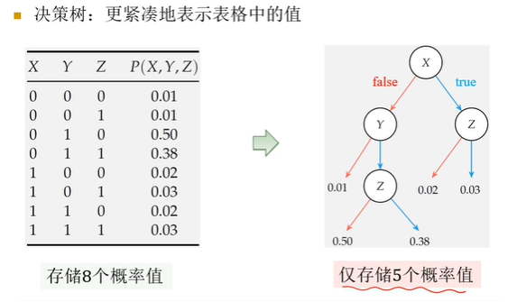
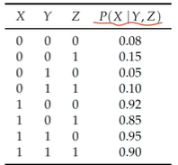
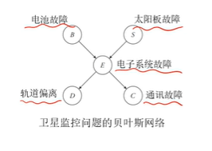
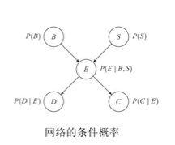
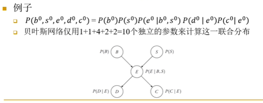
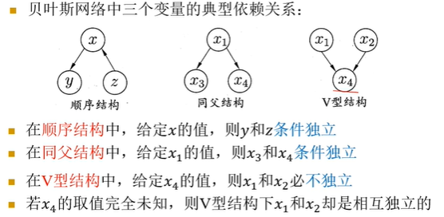
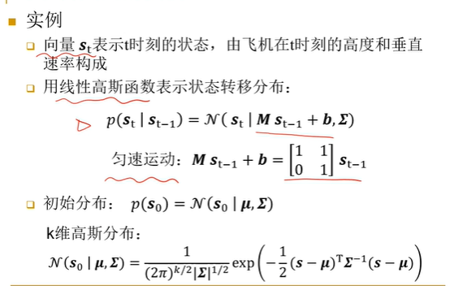
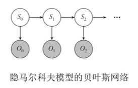

# 概率模型：不确定的表示
## 信念度和概率
+ 如果命题A比命题B在概率上有更高可能成立，则记$A\succ B$
+ 如果有相同的可信程度，记为$A\sim B$
+ 条件概率下相似成立，例如$A|C\succ B|C$
### 信念度
+ 可比性假设：$(A|C)\succ (B|C),(A|C)\sim (B|C),(A|C)\prec$中必有一个成立
+ 传递性假设：如果$(A|D)\succcurlyeq (B|D), (B|D)\succcurlyeq (C|D)$，则$(A|D)\succcurlyeq (C|D)$
+ 基于这两套假设，可以用实值函数$P$表示**信念度**
+ 令实值函数$P$满足概率定义，作为对某事件发生概率的度量

### 全概率法则
$$P(A|C) = \sum_{B\in\mathcal{B}}P(A|B,C)P(B|C)$$
其中$\mathcal{B}$是由互斥可穷举的命题构成的集合
### 贝叶斯规则
$$P(A|B,E) = \frac{P(B|A,E)P(A|E)}{P(B|E)}$$

## 概率分布
+ 离散概率分布
  + 二值随机变量
    + $P(x^0)$：x取值为0的概率
    + $P(x^1)$：x取值为1的概率
  + n值随机变量
    + $P(x^1), P(x^2), ...,P(x^n)$
    + 实际上只有n个自由度
+ 连续概率分布
  + 概率密度函数、累积分布函数定义略
  + **均匀分布**  
    
  + **高斯分布**  
  
    + 然而，高斯分布存在两个局限，一是高斯分布的分布范围为$[-\infty, +\infty]$，二是高斯分布是单模态的。针对于此我们提出下述的截断式高斯分布和多模态高斯分布
  + **截断式高斯分布**  
  
    + 有点归一化的思路，本质上是截断了分布防止延申到无穷处
  + **多模态的高斯分布**
    + 不同高斯分布的加权平均
    + 密度函数为$p(x|\mu_1,\sigma_1^2, ...,\mu_n,\sigma_n^2,\rho_1,...,\rho_n)=\sum_{i=1}^{n}\rho_i\mathcal{N}(w|\mu_i,\sigma_i^2)$
    + 其中$\sigma_{i=1}^n\rho_i=1$

## 联合分布
+ 多个随机变量的概率分布
+ 离散联合分布
  + 表格形式，相当于列举法，略
    + 如果有n个二值变量，则有$2^n-1$个独立的参数，指数增长
> **独立性假设**
> 变量$X,Y$独立，当且仅当$P(X,Y)=P(X)P(Y)$，记为$X\perp Y$
> 通过独立性假设，可仅使用n-1个独立的参数得到联合分布
> *独立性假设能否应用依赖于对该领域的先验知识*

> **决策树表示**  
> 

+ 连续联合分布
  + 多元均匀分布
    + 概率密度函数为$U(\bold{x}|\bold{a,b})=\Pi_{i=1}^nU(x_i|a_i,b_i)$
    + 总共2n个独立的参数
    + 多元均匀分布的混合模型  
    
  + 多元高斯分布$\mathcal{N}(\bold{\mu},\bold{\Sigma})$  
    
    + 多元高斯分布的混合模型  
    
  
## 条件概率分布
+ **离散条件模型**
  + 表格表示
  + 给定证据y和z，所有x的概率之和为1
  + $P(x_0|y,z)+P(x_1|y,z)=1$
  + 如果每个随机变量由m个离散取值，证据变量个数为n个，则表格有$m^{n+1}$行，独立参数个数为$m^n(m-1)$个，因为对于证据变量有$m^n$种组合，而条件概率下的求和性质使得每种组合下只有$m-1$个独立变量  
  
+ **条件高斯模型**
  + 给定一个或多个离散变量，一个连续变量的概率分布为
  $p(x|y)=\left\{
      \begin{aligned}
        &\mathcal{N}(x|\mu_1, \sigma_1^2), \ \ if\ y=y^1\\
        &...\\
        &\mathcal{N}(x|\mu_n,\sigma_n^2), \ \ if\ y=y^n)\\
      \end{aligned}
      \right.$
  + 显然，离散变量有m种取值，n个变量的情况下，参数个数为$2m^n$
+ **线性高斯模型**
  + 连续随机变量$X$的高斯分布，均值为连续随机变量$Y$取值的线性函数
  + 密度函数为$p(x|y)=\mathcal{N}(x|my+b, \sigma^2)$
+ **条件线性高斯模型**
  + $P(x|y) = \left\{
    \begin{aligned}
        &\mathcal{N}(x|m_1y+b_1, \sigma_1^2), \ \ if\ y=z^1\\
        &\mathcal{N}(x|m_ny+b_n, \sigma_n^2), \ \ if\ y=z^n\\
    \end{aligned}
    \right.$
+ **Sigmoid模型**
  + Sigmoid模型是给定一个连续变量$y$和一个二值变量$x$后产生的概率分布
  + logit模型
    + $P(x^1|y)=\frac 1{1+\exp(-2\frac{y-\theta_1}{\theta_2})}$，参数为$\theta_1$和$\theta_2$
  + probit模型
    + $P(x^1|y)=\Phi(y-\theta_1)/\theta_2$，参数为$\theta_1$和$\theta_2$
  
## 贝叶斯网络
+ 贝叶斯网络是联合概率分布的一种紧凑表示，形式上是有向无环图DAG
  + 节点：随机变量
  + 有向边：联接节点对
  + 通过节点之间的关系可写出各节点的条件概率分布  
  

### 贝叶斯网络中的条件独立
+ 给定$Z$，变量$X$和$Y$是独立的，当且仅当$P(X,Y|Z)=P(X|Z)P(Y|Z)$，记为$(X\perp Y|Z)$
  + $(X\perp Y|Z)$当且仅当$P(X|Z)=P(X|Y, Z)$
+ 由以上性质可知，给定父节点，贝叶斯网络中的节点$X$条件独立于它的非后代节点 

### 链式法则
设节点$X_i$的条件概率分布为$\mathbf{P}(X_i|Parent_{X_i})$，链式法则可被表述为
$$p(x_1, x_2, ...,x_n)=\Pi_{i=1}^np(x_i|parent_{x_i})$$
**这里有必要澄清一下语义**：
+ $\mathbf{P}$表示概率分布，$p$表示一个概率
+ $X$表示随机变量，$x$表示$X=x$
+ $Parent_X$表示是$X$的父亲的随机变量，$parent_x$表示这些父变量都按照某种规则取定了某些值

**例子**  

参数量的减少归功于条件独立性质

### 贝叶斯网络的结构  

最后一点的简单验证：
$p(x_1, x_2)=\sum_{x_4}p(x_1,x_2,x_4)=\sum_{x_4}p(x_4|x_1,x_2)p(x_1)p(x_2)=p(x_1)p(x_2)$

### 有向分离 d-seperation  

+ 如果两个节点$A,B$被节点集$\mathcal{E}$有向分离，则在给定这些节点的取值的前提下，有$A,B$条件独立，即$(A\bot B|\mathcal{E})$
### 马尔可夫覆盖
+ 马尔可夫覆盖（Markov Blanket）
  + 有向分离一个节点与其他节点的最少个数的节点构成的集合
  + 该集合由该节点的父节点、子节点和子节点的父节点构成
+ 一个节点的马尔科夫覆盖是将它与贝叶斯网络中所有其他节点完全有向分离开所需的最小节点集
  
### 混合贝叶斯网络
+ 包含离散的和连续的变量的贝叶斯网络
以下展示一个建模过程  

## 时序模型
+ 时序模型表示一组变量如何随时间演进
### 马尔可夫模型
+ $S_t$表示t时刻的状态
+ 状态转移模型（时间演进）通过条件分布$\bold{P}(S_t|S_{t-1})$来建模
+ 初始分布为$\bold{P}(S_0)$  

+ **马尔可夫性质**：系统下一时刻的状态仅有当前状态决定，不依赖以往的任何状态
+ 如果状态转移的条件分布$\bold{P}(S_t|S_{t-1})$不随时间$t$变化，那么称该模型是**稳态的**

**建模实例**  

### 隐马尔可夫模型
+ 在马尔可夫链上增加观察节点
  + 状态变量$S_i$是离散的  

### 线性动态系统
+ 在马尔可夫链上增加观察节点
  + 状态变量$S_i$是连续的且条件分布是线性高斯分布
+ 实例：在之前对于飞机状态的建模中，可以对飞机高度进行观察，这个观察变量的分布满足$\bold{P}(O_t|s_t)=\mathcal{N}(O_t|[1\ \ 0]s_t,\Sigma)$

### 动态贝叶斯网络
+ 动态贝叶斯网络（DBN）是一种表示时序概率模型的网络，在每个时间片可以有任意个状态变量和观察变量
+ 一方面，HMM是一种特殊地DBN；另一方面，将DBN中同一时间片的多个状态变量收缩为一个元组，将多个观察变量收缩为一个元组，那么就转化为了HMM
+ 然而，考虑以下一种情形就可以发现DBN的价值
  + 假设在每个时间片有20个布尔状态变量，每个变量在前一个时间片有三个父节点，那么使用收缩后的HMM网络需要存储$2^{40}$个数据，而DBN只需要存储$20\times 2^3=160$个数据
  + 所以DBN的价值在于**通过将复杂系统的状态分解为一些组成变量，DBN能充分利用时序概率模型中的稀疏性**

+ 构造DBN
  + 一个贝叶斯网络表示初始分布
  + 一个贝叶斯网络表示转移分布  
