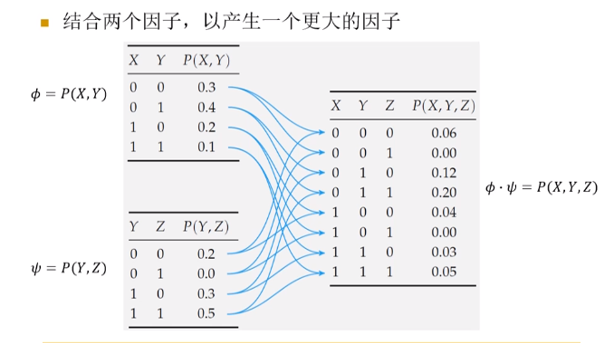
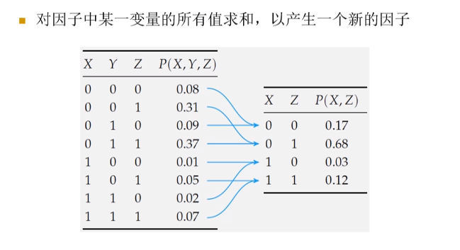
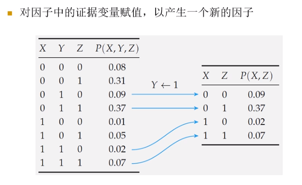
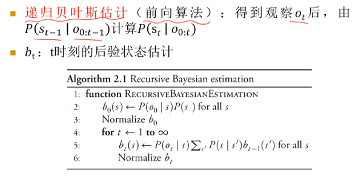
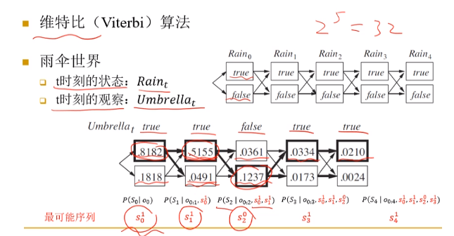
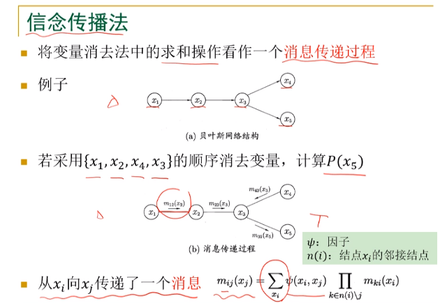
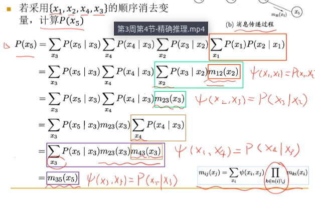

# 概率模型：概率推理
## 贝叶斯网络中的推理
+ 推理：由一组证据变量的值确定一个或多个查询变量的分布  

> 计算$Pr(B|d, c)$
> $Pr(b|d, c)=Pr(b, d, c)/Pr(d, c)=\sum_s\sum_ePr(b, s, e, d, c)/Pr(d, c)=\sum_s\sum_ePr(b)Pr(s)Pr(e|b, s)Pr(d|e)Pr(c|e)$

+ 总结：$P(\mathcal{Y})=\sum_{\mathcal{X}}\prod _iPr(X_i|Parent_{X_i})$
  + 其中$\mathcal{X}$为隐变量集合，$\mathcal{Y}$为查询变量和证据变量的集合
  + 求积号步骤被叫做因子相乘（实际就是链式法则）
  + 求和号步骤被叫做因子边际化
  + 最后对已知的证据变量进行赋值

### 因子相乘

+ 类似于在表格$T(X, Y)$和表格$T(Y, Z)$上进行了联结操作，对应因子相乘

### 因子边际化

+ 将求和变量以外的变量一次固定得到一系列子矩阵，对子矩阵的元素求和
+ 不依赖求和变量的因子可提取到求和号之外

### 设置证据

## 分类推理
+ 用于分类任务
### 朴素贝叶斯模型  

+ $O_1, ...,O_n$为证据变量，$C$为类别
+ 朴素贝叶斯假设：给定所属的类别，证据变量（即特征）之间条件独立：$O_i\perp O_j|C$
+ 如果假设不成立，可以在证据变量之间添加有向边表示特征之间的关系
+ 在朴素贝叶斯模型中，需要给出类别的先验概率分布$Pr(C)$和条件概率分布$Pr(O_i|C)$
> 若在朴素贝叶斯网络中求解条件概率$Pr(c|o_1, ..., o_n)$  
> $Pr(c, o_{1:n})=Pr(c)\prod _{i=1}^nPr(o_i|c)$  
> 而$Pr(o_{1:n})=\sum_c\prod _{i=1}^nPr(o_i|c)$，是一个常数，令该值等于$\frac 1{\mathcal{X}}$，则有$Pr(c|o_{1:n})=\mathcal{X}P(c, o_{1:n})$

## 时序模型中的推理
  
+ 在HMM模型上，常见的推理任务有
  + **滤波**：$Pr(s_t|o_{0:t})$
  + **预测**：$Pr(s_{t'}|o_{0:t})$, $t'>t$
  + **平滑**：$Pr(s_{t'}|o_{0:t})$, $t'<t$
  + **最可能序列**：$\text{argmax}_{s_{o:t}}P(s_{0:t}|o_{0:t})$

### 滤波
+ 目标：求解$P(s_t|o_{o:t})$
1. 由于$s_t$和$o_t$之间存在依赖关系，故可通过贝叶斯规则得到
   $$P(s_t|o_{0:t})\propto P(o_t|s_t, o_{0:t-1})P(s_t|o_{1:t-1})$$
2. 由贝叶斯网络的条件独立性$(o_t\perp o_{1:t-1}|s_t)$，故
   $$P(s_t|o_{0:t})\propto P(o_t|s_t)\sum_{s_{t-1}}P(s_t|s_{t-1}, o_{1:t-1})P(s_{t-1}|o_{1:t-1})$$
3. 进一步由$(s_t\perp o_{1:t-1}|s_{t-1})$，有
   $$P(s_t|o_{0:t})\propto P(o_t|s_t)\sum_{s_{t-1}}P(s_t|s_{t-1})P(s_{t-1}|o_{1:t-1})$$
4. 进一步假设在滤波任务中状态转移分布和观察分布是稳态的，则有**递归贝叶斯估计算法**  
   
   + 注意代码第二行，根据算法我们要计算$P(s_0|o_0)$，而代码给出的实际上是$P(s_0, o_0)$。只要有第三行的归一化步骤，也是可以work的
   + 当观察连续时，$P(o|s)$变成概率密度函数，第五行变成求积分，$b$变成密度函数

### 预测
+ 目标是求解$P(s_{t+k+1}|o_{0:t})$, $k\geq 0$
+ 分为两步求解
1. 单步预测（滤波）
   $$P(s_t|o_{0:t})\propto P(o_t|s_t)\sum_{s_{t-1}}P(s_t|s_{t-1})P(s_{t-1}|o_{1:t-1})$$
2. 没有增加新观察下的滤波，只涉及转移分布
   $$P(s_{t+k+1}|o_{0:t})=\sum_{s_{t+k}}P(s_{t+k+1}|s_{t+k})P(s_{t+k}|o_{0:t})$$

### 平滑
+ 目标是求解$P(s_k|o_{0:t})$, $0\leq k<t$
1. $P(s_k|o_{0:t})=P(s_k|o_{0:k}, o_{k+1:t})\propto P(s_k|o_{0:k})P(o_{k+1:t}|s_k, o_{0:k})$
2. 第一个式子可使用前向算法进行求解，第二项可使用后向算法计算
3. 后向算法
  + 首先引入隐变量$s_{k+1}$
    $$P(o_{k+1:t}|s_k)=\sum_{s_{k+1}}P(o_{k+1:t}|s_k, s_{k+1})P(s_{k+1}|s_k)$$
  + 再由马尔科夫性质，给定$s_{k+1}$后$(o_{k+1:t}\perp s_{k}|s_{k+1})$, 因此有
    $$=\sum_{s_{k+1}}P(o_{k+1:t}|s_{k+1})P(s_{k+1}|s_k)$$
  + 再将$o_{k+2}$分离出来，有
    $$=\sum_{s_{k+1}}P(o_{k+1}|s_{k+1})P(o_{k+2:t}|s_{k+1})P(s_{k+1}|s_k)$$
  + 可以看到主要思想就是尽可能利用贝叶斯网络的条件独立性假设，将复杂的因子转化为已知的**转移分布或观察分布**。后向算法的第一步引入$s_{k+1}$分离了$o_{k+1:t}$和$s_k$，而最后一步利用了$o_{k+1}$和$o_{k+2:t}$被$s_{k+1}$分离的条件

### 寻找最可能序列
+ 目标是求解$\text{argmax}_{s_{0:t}}P(s_{0:t}|o_{0:t})$
+ **维特比算法**

TODO(学习维特比算法)

## 精确推理
+ 计算查询变量的边际分布或条件分布的精确值

### 枚举推理
+ $P(\mathcal{Y})=\sum_{\mathcal{X}}\prod _iPr(X_i|Parent_{X_i})$
  + 其中$\mathcal{X}$为隐变量集合，$\mathcal{Y}$为查询变量和证据变量的集合
  + 求积号步骤被叫做因子相乘（实际就是链式法则）
  + 求和号步骤被叫做因子边际化
  + 最后对已知的证据变量进行赋值
  + 随着隐变量数目增加，求和项数目指数增长。$O(n\cdot 2^n)$
+ 这一部分的算法在《人工智能——一种现代的方法》pp438有详细的算法解释

### 变量消去法

+ **$X_i$均为隐变量**
+ 图中的Tables即为我们所指的“因子”
+ 由此可见，贝叶斯精确推理的关键任务在于按一定顺序消去隐变量，因子相乘不考虑变量位置
+ 一方面，选择最优的消元顺序实际上是**NP-hard**问题，即在最坏情况下不能在多项式时间内求解；另一方面，即使得到了最优的消元顺序，变量消去法所需要的计算时间仍然可以是网络大小的指数级复杂度
+ **缺点**：若需要执行给定证据变量相同的多个不同的边际分布，反复使用变量消去法会有大量冗余计算

### 信念传播法
+ 将变量消去法中的求和操作看作一个消息传递过程  

+ 定义message：$m_{ij}(x_j)=\sum_{x_i}\psi (x_i, x_j)\prod_{k\in n(i)\backslash j}m_{ki}(x_i)$, $\psi$实际上就是因子，每个节点的条件概率
+ 消息实际上是到达该节点的一种“**概率上的累积**”  
  

+ 一个节点只有在接收到来自其他所有节点的消息后才能向另一个节点发送消息
+ **节点的边际分布正比于它所接收的消息的乘积**
  $$P(x_i)\propto \prod_{k\in n(i)}m_{ki}(x_i)$$
  + 通过这个性质，可以两次遍历树，得到每条边上双向的消息，进一步计算每个节点上的边际概率