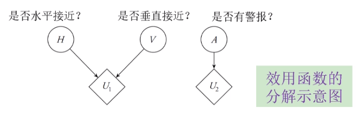

# 效用理论
## 偏好与效用
+ 偏好：比较两种不同结果的渴求程度
  + $A\succ B$表示Agent偏好A甚于偏好B
  + $A\sim B$表示Agent对A，B偏好相同
  + 偏好是主观的概念

### 彩票抽奖
+ 将每个行动视作抽取一张彩票，可能结果为$S_{1:n}$，其发生概率为$p_{1:n}$，则一次抽奖可记为$[S_1:p_1;...;S_n:p_n]$

### 理性偏好的约束
+ **冯诺依曼-摩根斯坦公理：刻画了一个理性行为必须具备的性质**
  + **完整性**： $A\succ B$, $B\succ A$, $A\sim B$中有且仅有一个成立
  + **传递性**： 若$A\succeq B$, $B\succ C$, 则$A\succ C$
  + **连续性**：如果$A\succeq C\succeq B$，则存在概率$p$使得$[A:p; B:1-p]\sim C$
  + **独立性**：如果$A\succ B$，则对于任何$C$和概率$p$，有$[A:p; C:1-p]\succeq[B:p; C:1-p]$

> 例：  
> 

### 偏好与效用
+ 正如信念度会导致*概率*这种度量，偏好会导致*效用*这种度量
+ 存在实数效用函数$U$，使
  + $U(A)>U(B)$ iff $A\succ B$
  + $U(A)=U(B)$ iff $A\sim B$
+ 效用函数不是唯一的。在经过仿射变换$U'(s)=m^2U(s)+b$后，Agent的行为并不会改变
  + 通过仿射变换我们可以得到不同但彼此作用相同的效用函数

> 例：一次抽奖的效用  
> $U([S_1:p_1; ...;S_n:p_n])=\sum_{i=1}^np_iU(S_i)$
> 也就是各状态的效用按照它们发生的概率加权求和，在后面我们可看到，这实际上是**期望效用**

## 期望效用最大化

### 最大化期望效用原则
+ 在不完全可观察的环境，如何进行理性决策？
+ 问题建模
  + 假设有一概率模型$P(s'|a, o)$，表示Agent在给定观察$0$的情况下采取行动$a$，环境变成$s'$的概率
  + 则给定观察$o$，采取行动$a$的**期望效用**：$E U(a | o)=\sum_{\boldsymbol{s'}} P\left(\boldsymbol{s'} | a, o\right) U\left(\boldsymbol{s'}\right)$, 这里$ \boldsymbol{s'} $为给定观察$ \boldsymbol{o} $并**采取行动$a$后**其他机会节点的取值
+ **最大化期望效用原则**
  + 理性Agent应采取的行动为$a^{*}=\arg \max _{a} E U(a | o)$

### 期望效用与后决策失望
+ 很多时候我们实际使用的是真实期望效用的估计值$\widehat{E U}(a | o)$
+ 假设$\widehat{E U}(a | o)$是$EU(a|o)的$的无偏估计，即有$E(\widehat{E U}(a | o)-E U(a | o))=0$
  + 即使是这样，真实结果通常比估计的要差很多，即$E\left(\max _{a} \widehat{E U}(a | o)-\max _{a} E U(a | o)\right) \geq 0$
  + 我们可对此现象进行简单证明：
    + 假设所有行动$a$得到的n种选项的先验概率满足均一分布，并且在每个选项i上，估计相对于真实效用的误差$\sigma_i$服从$ \mathcal{N}(0, 1) $
    + 则$\max_a{\widehat{EU}}\sim \max\{\sigma_1, \sigma_2, ..., \sigma_n\}$，已知它的均值大于0.
  + **乐观者诅咒**：最佳选项的估计期望效用往往会高于真实值，选项越多的人越容易对自己的选择产生失望

## 效用函数
+ **效用函数实际上就是将某一个变量映射到它在人/Agent心中接受程度的函数**
+ 对效用函数的深入讨论：形式和设计方法
+ 很多情况下获得一个好的效用函数比学习一个概率模型更困难
  + 概率可以从数据集或专家处学习
  + 效用则含有很大的主观性，且无法被直接观察

### 效用启发式
+ **归一化的效用函数**：最好结果的效用为1，最坏结果的效用为0，其他结果的效用分布在0,1之间的效用函数
  + 在这种情况下，我们常常假设**效用函数是非负的**，无论是对于多变量还是单变量
  + 可以对已知效用函数进行仿射变换进行归一化
+ **效用启发式**: 向Agent提供选项，根据Agent的选择偏好来不断调整从而建立效用函数的取值
  + 一种方法
    + 固定两个特殊结果的效用来建立一种尺度
    + 把最坏结果$S_\perp$固定为0， 最好结果$S_\top$固定为1
    + 对于结果$S$，调节概率p直到Agent对$S$和标准抽奖$[S_\top:p;S_\perp:1-p]$没有偏向性。
    + 易知$U(S)=p$

### 货币效用与货币总量
+ 货币效用与货币总量的关系是非线性的
+ 经验心理学表明，总量为$k$的货币效用为$U(k)=\alpha+\beta\log(k+\gamma)$

### 风险态度
+ 问题描述
  + 假设A：Agent得到50元
  + 假设B：Agent以50%的概率得到100元
+ 限讨论关于收益货币数量的效用函数$U$
+ **分险中立**：效用函数是线性的
  + $A\sim B$
+ **追求风险**：效用函数为上凹
  + $A\prec B$
+ **规避风险**：效用函数上凸
  + $A\succ B$

## 多变量效用函数
+ 令有n个变量的效用函数为$U(x_{1:n})$，即效用和多个变量因素相关
+ 通常情况下，对于n个k值变量，归一化后的效用函数需要指定在$k^n-2$个可能组合上的效用
+ 如果变量之间存在不同形式的独立性，可以压缩表示效用函数
  + $U\left(x_{1}, \cdots, x_{n}\right)=f\left[f_{1}\left(x_{1}\right), \cdots, f_{n}\left(x_{n}\right)\right]$

### 独立性：偏好独立性
+ 令 $ \mathrm{X}, \mathrm{Y} $是效用变量集$ \mathrm{V} $的不相交划分
  + $ \mathrm{X} $在 $ \succ $ 上**偏好独立**于 $ \mathrm{Y}=\mathrm{V}-\mathrm{X} $ ，如果对于所有的 $ \mathbf{y} $, $ \mathbf{y'} \in Val(\mathrm{Y})$ 以及所有的 $ \mathbf{x_1}, \mathbf{x_2}\in Val(\mathrm{X}) $, 有 $ \mathbf{x_1}\succ_{ \mathbf{y} } \mathbf{x_2}\leftrightarrow \mathbf{x_1}\succ_{\mathbf{y'}}\mathbf{x_2} $ 
  + 也就是无论 $ \mathrm{Y} $ 的取值如何，Agent对于变量集合 $ \mathrm{X} $ 中的偏好次序不变
  + 如果效用变量集 $ \mathrm{V} $ 中的任意变量都独立于其补集，则称变量集合$ \mathrm{V} $满足**相互偏好独立性**
  + **偏好独立性不是对称的关系**：考虑例子$ (s^1, f^1)\succ (s^1, f^0)\succ (s^0, f^0)\succ (s^0, f^1) $

#### 加法效用函数
+ 如果变量$X_{1:n}$是相互偏好独立的，则可以使用单一变量的效用函数之和来表示多变量效用函数，称为**加法效用函数**
  + $ U(x_{1:n})=\sum_{i=1}^nU(x_i) $
+ 进一步假设所有变量是k值的，则仅需指定$kn$个值来确定该效用函数

#### 效用函数的分解
+ 很多问题的效用函数不满足相互偏好独立性，但满足部分偏好独立性
+ 考虑一个例子  
  
  + $ A $与其他变量偏好独立，H和V不满足偏好独立
  + 因此$ U(h, v, a) = U(a) + U(h, v) $
  + 分解图示  
    
    + 效用节点（菱形）
    + 不确定性节点（圆形）
    + 总的小勇值为效用节点的效用值之和

### 独立性：效用独立性
+ 令$ \mathrm{X}, \mathrm{Y} $是效用集合$ \mathrm{V} $的不相交划分，$ \mathrm{X} $在$\succ$上**效用独立**于$ \mathrm{Y}=\mathrm{V}-\mathrm{X} $，如果对于所有的$ \mathbf{y}, \mathbf{y'} \in Val(\mathrm{Y})$，以及$Val(\mathrm{X})$上的任意一对抽奖$L_1, L_2$，有 $L_1\succ_{\mathrm{y}} L_2\leftrightarrow L_1\succ_{\mathrm{y'}}L_2$
+ 显然，效用独立性比偏好独立性条件更像
+ **【Thm】**: 集合$X$在$\succ$上效用独立于$Y=V-X$，当且仅当$U(V)=f(Y)+g(Y)h(X)$
+ **相互效用独立性**：变量集$V$中的任意变量都在$\succ$上效用独立于其补集

#### 乘法效用函数
+ 如果变量集$V$满足相互效用独立性，则效用函数可以被表示为乘法效用函数
+ 例子
  + 令$U_i$表示$U(x_i)$，如果$X=\{x_1, x_2, x_3\}$满足相互效用独立性，则$ U(x_1,x_2, x_3)=k_1U_1+k_2U_2+k_3U_3+k_1k_2U_1U_2+k_2k_3U_2U_3+k_1k_3U_1U_3+k_1k_2k_3U_1U_2U_3 $
+ 呈现相互效用独立性的n变量问题可用n个单一效用变量函数和n个常数建模

## 人类评价与非理性
+ 人类的非理性行为会引起悖论
+ **决策理论**：一种规范性理论，描述了一个理性的Agent应该如何行动
+ **描述性理论**：描述了实际的Agent真正如何行动