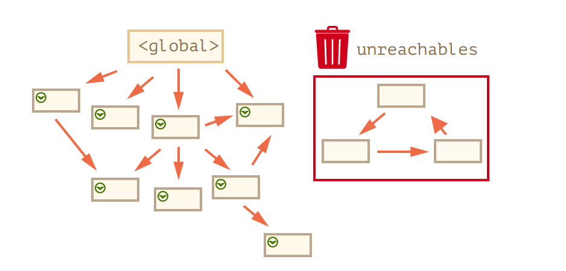

# JS对象

## 对象操作
+ JavaScript中的对象是一组键值对
```javascript
let key = "MyKey"
let name = 'John'

let user = new Object(); 
let user = {}; 
let user = {
    age: 30, 
    "likes birds": true, 
    [key]: "MyValue", 
    name,  // 与 name:name 相同
};
```
+ 可见，键的类型可以为字面量、字符串或者是某个表达式的值（使用`[key]`可以计算方括号内表达式的值并以之为键）。属性名可以是任意字符串或`symbol`，其他类型将会被自动转为字符串。
+ 获取属性时，可以使用点号或方括号

## 判断键的存在性
+ 当查询的键不存在时，返回`undefined`
+ 我们可以使用`in`操作符判断对象是否包含某个键值对
```javascript
alert("test" in obj)
```
+ 可以使用`for (... in ...) `迭代遍历对象中的键
```javascript
for (let key in obj) {
    alert(`obj[${key}] is ${obj[key]}`)
}
```
  + 遍历时，如果键可以被转化为整数（比如`"12"`），则先按照数字顺序排序输出；否则，按照最初添加的顺序进行顺序遍历

## 对象的引用
+ 对于Primitive Type，赋值和比较实际上都是基于值；对于对象Object，赋值和比较实际上都是基于引用
```javascript
let p1 = "abc";
let p2 = p1;

let o1 = {}, o2 = {}; 

p1==p2 // true
o1==o2 // false
```
+ 对象的浅拷贝可以使用`assign`方法
```javascript
Object.assign(dest, [src1, src2, ...]);
new_object = Object.assign({}, [o1, o2]);
```
  + 这个方法会把`src1, src2, ...`中的所有属性按次序拷贝到目标对象中。
+ 如果对象中还存在对象，此时需要对象的深拷贝。对象的深拷贝可以使用`lodash`库中的`_.cloneDeep(obj)`。
```javascript
var objects = [{ 'a': 1 }, { 'b': 2 }];
 
var deep = _.cloneDeep(objects);
console.log(deep[0] === objects[0]);
```

## JS的GC
+ 'mark and sweep'
  + 实际上就是标记可达节点，并释放不可达节点的内存  
  
+ 优化建议
  + **Generational Collection**: 新创建的对象往往很快过期，因此需要高频的可达性检查；旧的对象检查的频率相对较低。
  + **Incremental Collection**: 将GC任务分成几个部分来做，从而大的延迟会被分解为多个小的延迟。
  + **Idle-time Collection**: 在CPU空闲时进行GC。

## 对象方法和this指针
+ JS中对象方法的定义方式比较灵活，既可以使用给对象属性赋函数表达式的方式，也可以采用简略形式
```javascript
let obj1 = {
    name: name, 
    f: function() {
        return this.name;
    }
};

let obj2 = {
    name: name, 
    f() {
        return this.name; 
    }
};
```
+ 类似C语言，JS中的方法都含有隐藏的this指针。（甚至与函数都可以使用this指针，只不过this指针真正指向的对象是运行时计算的，如果这个函数不是作为对象方法被调用，则在严格模式下，this指针为`undefined`，在非全局模式下，this指针为全局对象）
  + 利用运行时计算的特性可实现函数在不同对象中的方法复用
  ```javascript
  let user = { name: "John" };
  let admin = { name: "Admin" };

  function sayHi() {
    alert( this.name );
  }

  // 在两个对象中使用相同的函数
  user.f = sayHi;
  admin.f = sayHi;
  ```
+ 注意，箭头函数没有自己的this。如果箭头函数中调用了this，实际上会绑定到外层作用域中的this。

## 对象的构造
+ 除了使用字面量创建对象外，还可以使用构造函数的方式。
  + 构造函数本质上是隐式地创建了一个空对象用于属性赋值，然后在构造函数的末尾隐式地返回这个对象。
  + 如果在构造函数中存在return语句，如果return语句返回的是一个object，则最终构造函数也将返回这个object；但是如果return语句返回Primitive Type，则该语句将被忽略。
  ```javascript
  function User(name) {
    this.name = name;

    this.sayHi = function() {
      alert( "My name is: " + this.name );
    };
  }

  let john = new User("John");

  john.sayHi(); // My name is: John
  ```

## 可选链
+ 可以使用可选链`?.`判断连续取值时的存在性问题。如果`?.`前的符号为`undefined`或`null`，那么后续的取值运算将不再进行，直接返回`?.`前的值。
+ `?.()`是另一种检查函数存在性的方法。如果`?.()`左边的方法存在，那么就会调用并运行它；否则直接停止运算取值运算，返回`undefined`。
+ 总而言之，`?.`和`?.()`方法都是检测该符号左边的值是否存在，不存在直接返回`null`/`undefined`。
```javascript
let test = {
    a:"a", 
    not_func: function() {
        return "func";
    }
};

console.log(test?.func?.())
```

## Symbol
+ 使用`let s = Symbol("description")`可创建描述为`description`的标识符。
  + Symbol在全局是唯一的，哪怕描述相同。因此，Symbol可用于对象的隐藏属性的键值。
  + 比如，某个第三方库的对象，我的需求是向其中添加一些属性，但是不希望因为重名的原因导致属性被覆盖，此时可以使用Symbol创建唯一的标识符。
  + 除此以外，还可以使用Symbol创建对象的私有属性。
+ 如果希望描述和Symbol能够一一对应，此时可使用全局Symbol表
```javascript
// 从全局注册表中读取，不存在则创建这个symbol
let sym = Symbol.for("description")
let symAgain = Symbol.for("description")
console.log(sym === symAgain) // true

let des = Symbol.keyFor(sym) // des为description
```

## 对象和原始值转换

+ 而操作符和hint的关系如下
  + **String Hint**
  ```javascript
  // 输出
  alert(obj);

  // 将对象作为属性键
  anotherObj[obj] = 123;
  ```
  + **Number Hint**
  ```javascript
  // 显式转换
  let num = Number(obj);

  // 数学运算（除了二进制加法）
  let n = +obj; // 一元加法
  let delta = date1 - date2;

  // 小于/大于的比较
  let greater = user1 > user2;
  ```
  + **Default Hint**
  ```javascript
  // 二元加法使用默认 hint
  let total = obj1 + obj2;

  // obj == number 使用默认 hint
  if (user == 1) { ... };
  ```